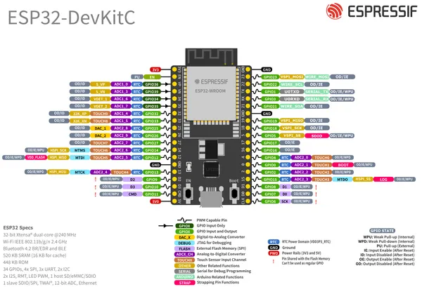
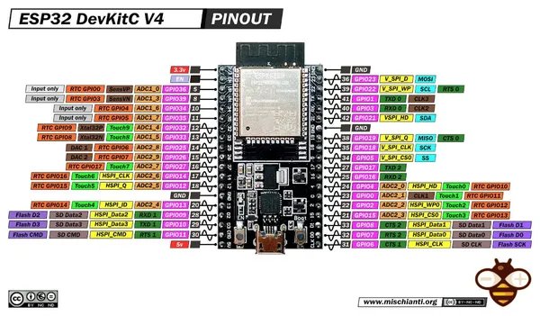

# ESP32-DevKitC V4

**Espressif** · ESP32 original

Revision: Multiple source/revision records; see individual assets  
Coverage: Pinout image collected

[Browse all manufacturers](../../../../BROWSE.md) · [Desktop app](https://github.com/valleytechsolutions/black-wire-desktop)

## Manufacturer board pinout

**pinout image** · Reviewed source · PNG

[Open original reference](../../../../library/media/e3217229b995ec7e1b5c525ffd93eced3b3a17827806907dd25a1609667283e2.png)

**Credit and rights:** Not established; source attribution retained. Source/manufacturer: Espressif.

[Source 1](https://raw.githubusercontent.com/espressif/esp-dev-kits/ab7aff2e0c171e6918c88555b700798f36caeb67/docs/_static/esp32-devkitc/esp32_devkitC_v4_pinlayout.png) · [Source 2](https://github.com/espressif/esp-dev-kits/blob/ab7aff2e0c171e6918c88555b700798f36caeb67/docs/_static/esp32-devkitc/esp32_devkitC_v4_pinlayout.png)

Original image from the manufacturer documentation repository; exact commit recorded in source URL.

SHA-256: `e3217229b995ec7e1b5c525ffd93eced3b3a17827806907dd25a1609667283e2`

## Pinout - Renzo Mischianti

**pinout image** · Reviewed source · JPG

[Open original reference](../../../../library/media/4f8547ea19c8ee6da2cea8528c77274d3a590b8891062808f4dfcdb58c55ebb3.jpg)

**Credit and rights:** CC BY-NC-ND marking visible on image; exact license version and publication permissions not established. Source/manufacturer: Espressif.

[Source 1](https://mischianti.org/wp-content/uploads/2021/07/ESP32-DEV-KIT-DevKitC-v4-pinout-mischianti.jpg) · [Source 2](https://mischianti.org/esp32-devkitc-v4-high-resolution-pinout-and-specs/)

Original public image by Renzo Mischianti, unchanged. Diagram/model matching is visual, not electrical verification. Exact PCB layout and revision must match; no inference of compatibility with lookalike marketplace clones.

SHA-256: `4f8547ea19c8ee6da2cea8528c77274d3a590b8891062808f4dfcdb58c55ebb3`

Pin assignments have not been independently electrically verified. Check board revision before wiring.
