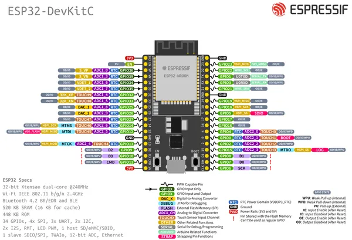

# ESP32-DevKitC-V4-WROOM-32E

**Espressif** · ESP32 original

Revision: Not identified  
Coverage: Pinout image collected

[Browse all manufacturers](../../../../BROWSE.md) · [Desktop app](https://github.com/valleytechsolutions/black-wire-desktop)

## Physical board pinout

**pinout image** · Reviewed source · PNG

[Open original reference](../../../../library/media/7d0fe74b814f0e3cd3554dcf0e483a9733c09e864d665af5c15ff1b83cfa6c14.png)

**Credit and rights:** Not established; source attribution retained. Source/manufacturer: Espressif.

[Source 1](https://cdn-shop.adafruit.com/product-files/3269/ESP32-DevKitC-v4-Pinout.png) · [Source 2](https://www.adafruit.com/product/3269)

Discovered from CircuitPython board metadata and the linked product/documentation page. Exact hardware revision requires matching to the diagram.

SHA-256: `7d0fe74b814f0e3cd3554dcf0e483a9733c09e864d665af5c15ff1b83cfa6c14`

Pin assignments have not been independently electrically verified. Check board revision before wiring.
