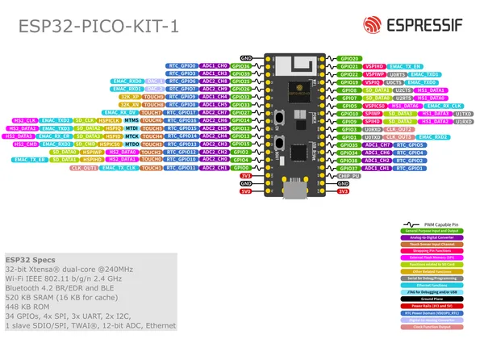

# ESP32-PICO-KIT-1

**Espressif** · ESP32 original

Revision: Multiple source/revision records; see individual assets  
Coverage: Pinout image collected

[Browse all manufacturers](../../../../BROWSE.md) · [Desktop app](https://github.com/valleytechsolutions/black-wire-desktop)

## Manufacturer board pinout

**pinout image** · Reviewed source · PNG

[Open original reference](../../../../library/media/512cae1cedac03ef42898460c193db97da5f15942af1bc10fc8c94357ad9f7cd.png)

**Credit and rights:** Not established; source attribution retained. Source/manufacturer: Espressif.

[Source 1](https://raw.githubusercontent.com/espressif/esp-dev-kits/ab7aff2e0c171e6918c88555b700798f36caeb67/docs/_static/esp32-pico-kit-1/esp32-pico-kit-1-pin-layout.png) · [Source 2](https://github.com/espressif/esp-dev-kits/blob/ab7aff2e0c171e6918c88555b700798f36caeb67/docs/_static/esp32-pico-kit-1/esp32-pico-kit-1-pin-layout.png)

Original image from the manufacturer documentation repository; exact commit recorded in source URL.

SHA-256: `512cae1cedac03ef42898460c193db97da5f15942af1bc10fc8c94357ad9f7cd`

Pin assignments have not been independently electrically verified. Check board revision before wiring.
