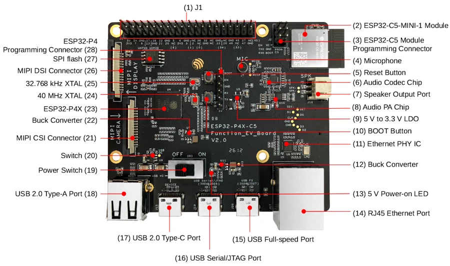
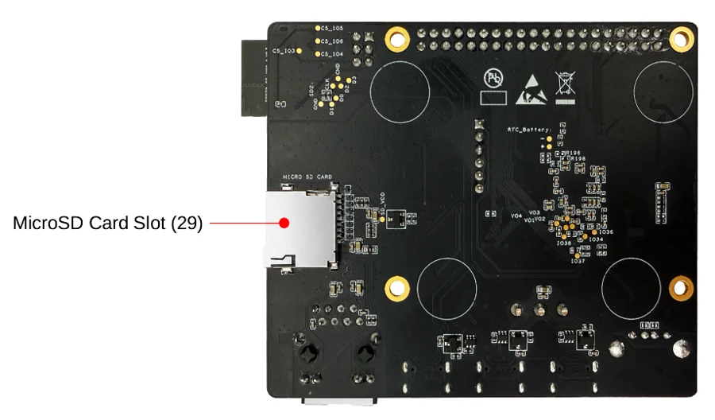

# ESP32-P4X-C5-Function-EV-Board

**Espressif** · ESP32-P4 / ESP32-C5

Revision: V2.0

Coverage: Supporting documentation; physical pinout still needed

[Browse all manufacturers](../../../../BROWSE.md) · [Devices & IoT](../../../../DEVICES.md) · [Open in the browser guide](https://valleytech-black-wire-guide.pages.dev/?board=espressif-esp32-p4x-c5-function-ev-board)

Architecture: **RISC-V**

## Datasheets and original documentation

Board datasheet: **not yet recorded**. Visual reference: **available**.

[Original manufacturer hardware documentation](https://docs.espressif.com/projects/esp-dev-kits/en/latest/esp32p4/esp32-p4x-c5-function-ev-board/user_guide.html)

- **hardware-guide / board**: [ESP32-P4X-C5-Function-EV-Board hardware guide](https://docs.espressif.com/projects/esp-dev-kits/en/latest/esp32p4/esp32-p4x-c5-function-ev-board/user_guide.html) · online
- **schematic / board**: [V2.0 mainboard schematic](https://dl.espressif.com/schematics/ESP32_P4X_C5_Function_EV_board-2.0-schematics.pdf) · [saved document](../../../../library/media/ceff97cf20e86b30480f8410d285f411108b4402beb2f63c1a0559f5119b9bd9.pdf)

Match the PCB revision and connector. Hardware guides, board datasheets, schematics and component data have different scopes.

[Documentation coverage and remaining gaps](../../../../DOCUMENTATION.md)

## Specifications and hardware documentation

- [Manufacturer hardware documentation](https://docs.espressif.com/projects/esp-dev-kits/en/latest/esp32p4/esp32-p4x-c5-function-ev-board/user_guide.html)

## esp32-p4x-c5-function-ev-board-front

**board labeling image** · Reviewed source · PNG

[Open original reference](../../../../library/media/765543fca85e224d5a4e69bdb3b0900e900bfb971cf5ce399b0a75c18d0fc9c5.png)

**Credit and rights:** Espressif / original contributors. Asset-specific redistribution and print rights have not been established. Original artwork is not relicensed by Black Wire's editorial license.. Source/manufacturer: Espressif.

[Source 1](https://docs.espressif.com/projects/esp-dev-kits/en/latest/esp32p4/_images/esp32-p4x-c5-function-ev-board-front.png) · [Source 2](https://docs.espressif.com/projects/esp-dev-kits/en/latest/esp32p4/esp32-p4x-c5-function-ev-board/user_guide.html)

Component and connector locations. Header pin function tables are separate; this image is not classified as a complete physical pinout.

Image revision: V2.0

SHA-256: `765543fca85e224d5a4e69bdb3b0900e900bfb971cf5ce399b0a75c18d0fc9c5`

## esp32-p4x-c5-function-ev-board-back

**board labeling image** · Reviewed source · PNG

[Open original reference](../../../../library/media/1fe444e3ff29586dd149a906bf72989d8ea8552f98e0d06c6c4f4533c8f75b24.png)

**Credit and rights:** Espressif / original contributors. Asset-specific redistribution and print rights have not been established. Original artwork is not relicensed by Black Wire's editorial license.. Source/manufacturer: Espressif.

[Source 1](https://docs.espressif.com/projects/esp-dev-kits/en/latest/esp32p4/_images/esp32-p4x-c5-function-ev-board-back.png) · [Source 2](https://docs.espressif.com/projects/esp-dev-kits/en/latest/esp32p4/esp32-p4x-c5-function-ev-board/user_guide.html)

Component and connector locations. Header pin function tables are separate; this image is not classified as a complete physical pinout.

Image revision: V2.0

SHA-256: `1fe444e3ff29586dd149a906bf72989d8ea8552f98e0d06c6c4f4533c8f75b24`

## V2.0 mainboard schematic

**original reference PDF** · Reviewed source · PDF

[Open original reference](../../../../library/media/ceff97cf20e86b30480f8410d285f411108b4402beb2f63c1a0559f5119b9bd9.pdf)

**Credit and rights:** Espressif / original contributors. Asset-specific redistribution and print rights have not been established. Original artwork is not relicensed by Black Wire's editorial license.. Source/manufacturer: Espressif.

[Source 1](https://dl.espressif.com/schematics/ESP32_P4X_C5_Function_EV_board-2.0-schematics.pdf) · [Source 2](https://docs.espressif.com/projects/esp-dev-kits/en/latest/esp32p4/esp32-p4x-c5-function-ev-board/user_guide.html)

Source reviewed for model and reference type; pin assignments are not independently electrically validated.

Image revision: V2.0

SHA-256: `ceff97cf20e86b30480f8410d285f411108b4402beb2f63c1a0559f5119b9bd9`

Pin assignments have not been independently electrically verified. Check board revision before wiring.
