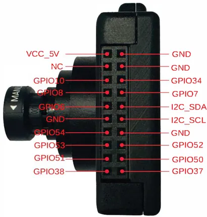

# ESP32-P4-EYE

**Espressif** · ESP32-P4

Revision: Source filename: p4_board_empty_pin.png  
Coverage: Pinout image collected

[Browse all manufacturers](../../../../BROWSE.md) · [Desktop app](https://github.com/valleytechsolutions/black-wire-desktop)

## Manufacturer board pin layout

**pinout image** · Reviewed source · PNG

[Open original reference](../../../../library/media/64df5136ac3be3cb8bcc29bd7431ce464a9fbe63d344ef524379a75793272a94.png)

**Credit and rights:** Not established; source attribution retained. Source/manufacturer: Espressif.

[Source 1](https://raw.githubusercontent.com/espressif/esp-dev-kits/ab7aff2e0c171e6918c88555b700798f36caeb67/docs/_static/esp32-p4-eye/p4_board_empty_pin.png) · [Source 2](https://github.com/espressif/esp-dev-kits/blob/ab7aff2e0c171e6918c88555b700798f36caeb67/docs/_static/esp32-p4-eye/p4_board_empty_pin.png)

SHA-256: `64df5136ac3be3cb8bcc29bd7431ce464a9fbe63d344ef524379a75793272a94`

Pin assignments have not been independently electrically verified. Check board revision before wiring.
