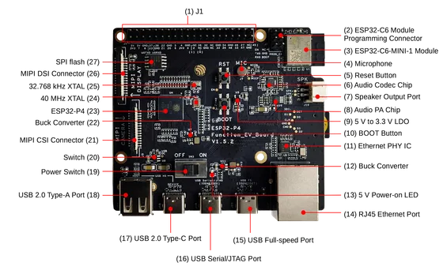

# ESP32-P4-Function-EV-Board v1.5.2

**Espressif** · ESP32-P4

Revision: v1.5.2

Coverage: Revision-specific schematic and component locations; complete physical connector map still needed

[Browse all manufacturers](../../../../BROWSE.md) · [Devices & IoT](../../../../DEVICES.md) · [Open in the browser guide](https://valleytech-black-wire-guide.pages.dev/?board=espressif-esp32-esp32-p4-function-ev-board)

## Manufacturer schematic — v1.5.2 (6 pages)

**original reference PDF** · Reviewed source · PDF

[Open original reference](../../../../library/media/7a1d12a37e21db20fe7db8092f4428b87465873feab65b3cd90bc6fe7dd6673b.pdf)

**Credit and rights:** Espressif Systems; artwork rights not established; source attribution retained. Source/manufacturer: Espressif.

[Source 1](https://dl.espressif.com/dl/schematics/esp32-p4-function-ev-board-schematics_v1.52.pdf) · [Source 2](https://docs.espressif.com/projects/esp-dev-kits/en/latest/esp32p4/esp32-p4-function-ev-board/user_guide.html)

v1.5.2 only; do not substitute for v1.4 or ESP32-P4X. The v1.5.2 header removes IO24/IO25 compared with v1.4. A schematic or component-location photo is not a complete physical pinout. See the official J1 table and its NC/resistor-option notes before wiring.

Image revision: v1.5.2

SHA-256: `7a1d12a37e21db20fe7db8092f4428b87465873feab65b3cd90bc6fe7dd6673b`

## Manufacturer front component locations — v1.5.2

**board labeling image** · Reviewed source · PNG

[Open original reference](../../../../library/media/65933cd852bec2a97a134d3d6531163d2af7b88ea77387dd9c2140ce1db01612.png)

**Credit and rights:** Espressif Systems; artwork rights not established; source attribution retained. Source/manufacturer: Espressif.

[Source 1](https://docs.espressif.com/projects/esp-dev-kits/en/latest/esp32p4/_images/esp32-p4-function-ev-board-annotated-photo-front_v1.5.2.png) · [Source 2](https://docs.espressif.com/projects/esp-dev-kits/en/latest/esp32p4/esp32-p4-function-ev-board/user_guide.html)

v1.5.2 only; do not substitute for v1.4 or ESP32-P4X. The v1.5.2 header removes IO24/IO25 compared with v1.4. A schematic or component-location photo is not a complete physical pinout. See the official J1 table and its NC/resistor-option notes before wiring.

Image revision: v1.5.2

SHA-256: `65933cd852bec2a97a134d3d6531163d2af7b88ea77387dd9c2140ce1db01612`

Pin assignments have not been independently electrically verified. Check board revision before wiring.
