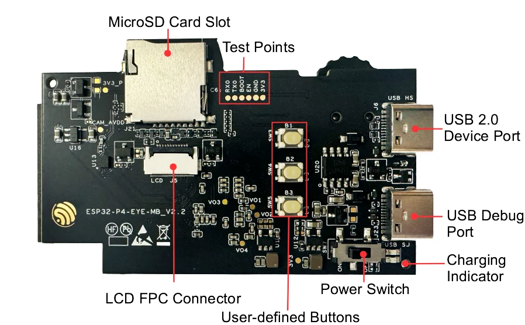
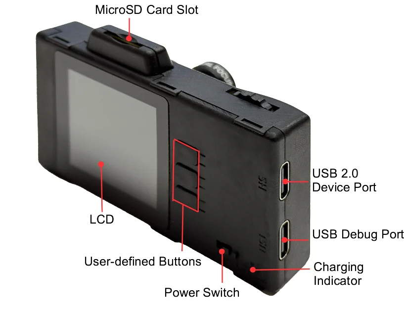
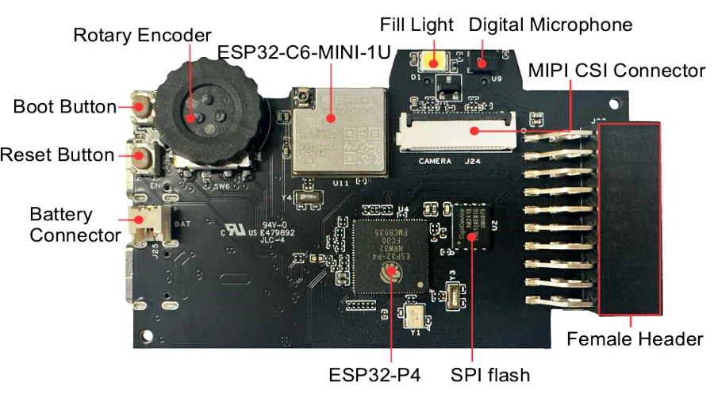
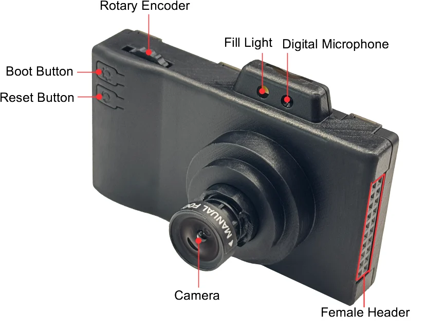

# ESP32-P4X-EYE

**Espressif** · ESP32-P4

Revision: As documented in the ESP32-P4X-EYE guide

Coverage: Supporting documentation; physical pinout still needed

[Browse all manufacturers](../../../../BROWSE.md) · [Devices & IoT](../../../../DEVICES.md) · [Open in the browser guide](https://valleytech-black-wire-guide.pages.dev/?board=espressif-esp32-p4x-eye)

Device category: **Cameras & vision**

Architecture: **RISC-V**

## Datasheets and original documentation

Board datasheet: **not yet recorded**. Visual reference: **available**.

[Original manufacturer hardware documentation](https://docs.espressif.com/projects/esp-dev-kits/en/latest/esp32p4/esp32-p4x-eye/user_guide.html)

- **hardware-guide / board**: [ESP32-P4X-EYE hardware guide](https://docs.espressif.com/projects/esp-dev-kits/en/latest/esp32p4/esp32-p4x-eye/user_guide.html) · online

Match the PCB revision and connector. Hardware guides, board datasheets, schematics and component data have different scopes.

[Documentation coverage and remaining gaps](../../../../DOCUMENTATION.md)

## Specifications and hardware documentation

- [Manufacturer hardware documentation](https://docs.espressif.com/projects/esp-dev-kits/en/latest/esp32p4/esp32-p4x-eye/user_guide.html)

## pic board top label

**board labeling image** · Reviewed source · PNG

[Open original reference](../../../../library/media/44ef7b505017e1d4384161c23eb3e69ea2f87bd1ea05bbc06e84e830c1f5cb22.png)

**Credit and rights:** Espressif / original contributors. Asset-specific redistribution and print rights have not been established. Original artwork is not relicensed by Black Wire's editorial license.. Source/manufacturer: Espressif.

[Source 1](https://docs.espressif.com/projects/esp-dev-kits/en/latest/esp32p4/_images/pic_board_top_label.png) · [Source 2](https://docs.espressif.com/projects/esp-dev-kits/en/latest/esp32p4/esp32-p4x-eye/user_guide.html)

Component and connector locations. Header pin function tables are separate; this image is not classified as a complete physical pinout.

Image revision: As documented in the ESP32-P4X-EYE guide

SHA-256: `44ef7b505017e1d4384161c23eb3e69ea2f87bd1ea05bbc06e84e830c1f5cb22`

## esp32 p4 eye back marked

**board labeling image** · Reviewed source · PNG

[Open original reference](../../../../library/media/3f86f34ac22c9f977049daa66168bed2dce3a63c3d731747ffe3354e706742d3.png)

**Credit and rights:** Espressif / original contributors. Asset-specific redistribution and print rights have not been established. Original artwork is not relicensed by Black Wire's editorial license.. Source/manufacturer: Espressif.

[Source 1](https://docs.espressif.com/projects/esp-dev-kits/en/latest/esp32p4/_images/esp32_p4_eye_back_marked.png) · [Source 2](https://docs.espressif.com/projects/esp-dev-kits/en/latest/esp32p4/esp32-p4x-eye/user_guide.html)

Component and connector locations. Header pin function tables are separate; this image is not classified as a complete physical pinout.

Image revision: As documented in the ESP32-P4X-EYE guide

SHA-256: `3f86f34ac22c9f977049daa66168bed2dce3a63c3d731747ffe3354e706742d3`

## pic board bottom label

**board labeling image** · Reviewed source · PNG

[Open original reference](../../../../library/media/7b91ff9d0a3bca2bbc1a6c4edb8015a07cc16160799e9415bb0cb3303369dd66.png)

**Credit and rights:** Espressif / original contributors. Asset-specific redistribution and print rights have not been established. Original artwork is not relicensed by Black Wire's editorial license.. Source/manufacturer: Espressif.

[Source 1](https://docs.espressif.com/projects/esp-dev-kits/en/latest/esp32p4/_images/pic_board_bottom_label.png) · [Source 2](https://docs.espressif.com/projects/esp-dev-kits/en/latest/esp32p4/esp32-p4x-eye/user_guide.html)

Component and connector locations. Header pin function tables are separate; this image is not classified as a complete physical pinout.

Image revision: As documented in the ESP32-P4X-EYE guide

SHA-256: `7b91ff9d0a3bca2bbc1a6c4edb8015a07cc16160799e9415bb0cb3303369dd66`

## esp32 p4 eye front marked

**board labeling image** · Reviewed source · PNG

[Open original reference](../../../../library/media/606849a41a36f1b6d6ed3440f01c36e59ee8d585999a95f6fd93ea1364d45097.png)

**Credit and rights:** Espressif / original contributors. Asset-specific redistribution and print rights have not been established. Original artwork is not relicensed by Black Wire's editorial license.. Source/manufacturer: Espressif.

[Source 1](https://docs.espressif.com/projects/esp-dev-kits/en/latest/esp32p4/_images/esp32_p4_eye_front_marked.png) · [Source 2](https://docs.espressif.com/projects/esp-dev-kits/en/latest/esp32p4/esp32-p4x-eye/user_guide.html)

Component and connector locations. Header pin function tables are separate; this image is not classified as a complete physical pinout.

Image revision: As documented in the ESP32-P4X-EYE guide

SHA-256: `606849a41a36f1b6d6ed3440f01c36e59ee8d585999a95f6fd93ea1364d45097`

Pin assignments have not been independently electrically verified. Check board revision before wiring.
