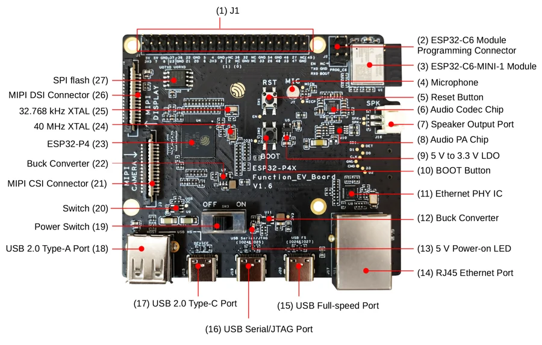
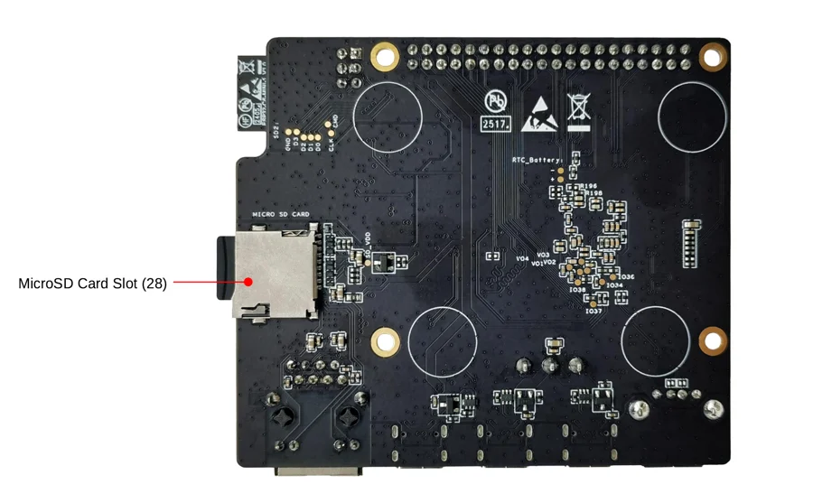

# ESP32-P4X-Function-EV-Board

**Espressif** · ESP32-P4

Revision: V1.6; back illustration reused from V1.5.2

Coverage: Supporting documentation; physical pinout still needed

[Browse all manufacturers](../../../../BROWSE.md) · [Devices & IoT](../../../../DEVICES.md) · [Open in the browser guide](https://valleytech-black-wire-guide.pages.dev/?board=espressif-esp32-esp32-p4x-function-ev)

Architecture: **RISC-V**

## Datasheets and original documentation

Board datasheet: **not yet recorded**. Visual reference: **available**.

[Original manufacturer hardware documentation](https://docs.espressif.com/projects/esp-dev-kits/en/latest/esp32p4/esp32-p4x-function-ev-board/user_guide.html)

- **hardware-guide / board**: [ESP32-P4X-Function-EV-Board hardware guide](https://docs.espressif.com/projects/esp-dev-kits/en/latest/esp32p4/esp32-p4x-function-ev-board/user_guide.html) · online

Match the PCB revision and connector. Hardware guides, board datasheets, schematics and component data have different scopes.

[Documentation coverage and remaining gaps](../../../../DOCUMENTATION.md)

## Specifications and hardware documentation

- [Manufacturer hardware documentation](https://docs.espressif.com/projects/esp-dev-kits/en/latest/esp32p4/esp32-p4x-function-ev-board/user_guide.html)

## esp32-p4x-function-ev-board-annotated-photo-front v1.6

**board labeling image** · Reviewed source · PNG

[Open original reference](../../../../library/media/3b3618994d46d46adfe1d6fd5df41587c264b17d8c70109fa519d4a35fdc2dbe.png)

**Credit and rights:** Espressif / original contributors. Asset-specific redistribution and print rights have not been established. Original artwork is not relicensed by Black Wire's editorial license.. Source/manufacturer: Espressif.

[Source 1](https://docs.espressif.com/projects/esp-dev-kits/en/latest/esp32p4/_images/esp32-p4x-function-ev-board-annotated-photo-front_v1.6.png) · [Source 2](https://docs.espressif.com/projects/esp-dev-kits/en/latest/esp32p4/esp32-p4x-function-ev-board/user_guide.html)

Component and connector locations. Header pin function tables are separate; this image is not classified as a complete physical pinout.

Image revision: V1.6; back illustration reused from V1.5.2

SHA-256: `3b3618994d46d46adfe1d6fd5df41587c264b17d8c70109fa519d4a35fdc2dbe`

## esp32-p4-function-ev-board-annotated-photo-back v1.5.2

**board labeling image** · Reviewed source · PNG

[Open original reference](../../../../library/media/dda183b1f5bd32ea3ebecaad3f217f3da2b7ce6365aa75ee4c3f31704b22b34b.png)

**Credit and rights:** Espressif / original contributors. Asset-specific redistribution and print rights have not been established. Original artwork is not relicensed by Black Wire's editorial license.. Source/manufacturer: Espressif.

[Source 1](https://docs.espressif.com/projects/esp-dev-kits/en/latest/esp32p4/_images/esp32-p4-function-ev-board-annotated-photo-back_v1.5.2.png) · [Source 2](https://docs.espressif.com/projects/esp-dev-kits/en/latest/esp32p4/esp32-p4x-function-ev-board/user_guide.html)

Component and connector locations. Header pin function tables are separate; this image is not classified as a complete physical pinout.

Image revision: V1.5.2 back illustration reused by the V1.6 guide

SHA-256: `dda183b1f5bd32ea3ebecaad3f217f3da2b7ce6365aa75ee4c3f31704b22b34b`

Pin assignments have not been independently electrically verified. Check board revision before wiring.
