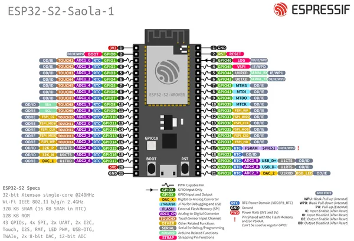

# ESP32-S2-SAOLA-1

**Espressif** · ESP32-S2

Revision: Multiple source/revision records; see individual assets  
Coverage: Pinout image collected

[Browse all manufacturers](../../../../BROWSE.md) · [Desktop app](https://github.com/valleytechsolutions/black-wire-desktop)

## Manufacturer board pinout

**pinout image** · Reviewed source · JPG

[Open original reference](../../../../library/media/255e97bc0a76b1e5a1ff8b1d7751ac7bdaab6259504f988e76cbda31406b7a58.jpg)

**Credit and rights:** Not established; source attribution retained. Source/manufacturer: Espressif.

[Source 1](https://raw.githubusercontent.com/espressif/esp-dev-kits/ab7aff2e0c171e6918c88555b700798f36caeb67/docs/_static/esp32-s2-saola-1/esp32-s2_saola1-pinout.jpg) · [Source 2](https://github.com/espressif/esp-dev-kits/blob/ab7aff2e0c171e6918c88555b700798f36caeb67/docs/_static/esp32-s2-saola-1/esp32-s2_saola1-pinout.jpg)

Original image from the manufacturer documentation repository; exact commit recorded in source URL.

SHA-256: `255e97bc0a76b1e5a1ff8b1d7751ac7bdaab6259504f988e76cbda31406b7a58`

Pin assignments have not been independently electrically verified. Check board revision before wiring.
