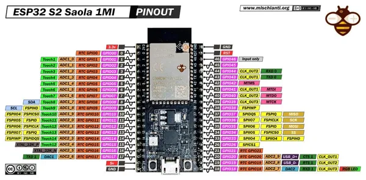

# ESP32-S2-Saola-1MI

**Espressif** · ESP32-S2

Revision: 1MI module layout shown  
Coverage: Pinout image collected

[Browse all manufacturers](../../../../BROWSE.md) · [Desktop app](https://github.com/valleytechsolutions/black-wire-desktop)

## Pinout - Renzo Mischianti

**pinout image** · Reviewed source · JPG

[Open original reference](../../../../library/media/6007f74f3d33251589617ffbfdfac8431cf9fbae47dd0de977c04d5502ecdf27.jpg)

**Credit and rights:** CC BY-NC-ND marking visible on image; exact license version and publication permissions not established. Source/manufacturer: Espressif.

[Source 1](https://mischianti.org/wp-content/uploads/2020/11/ESP32-S2-Saola-1MI-pinout-mischianti-low.jpg) · [Source 2](https://mischianti.org/esp32-s2-saola-1mi-1m-high-resolution-pinout-and-specs/)

Original public image by Renzo Mischianti, unchanged. Diagram/model matching is visual, not electrical verification. Exact PCB layout and revision must match; no inference of compatibility with lookalike marketplace clones.

SHA-256: `6007f74f3d33251589617ffbfdfac8431cf9fbae47dd0de977c04d5502ecdf27`

Pin assignments have not been independently electrically verified. Check board revision before wiring.
