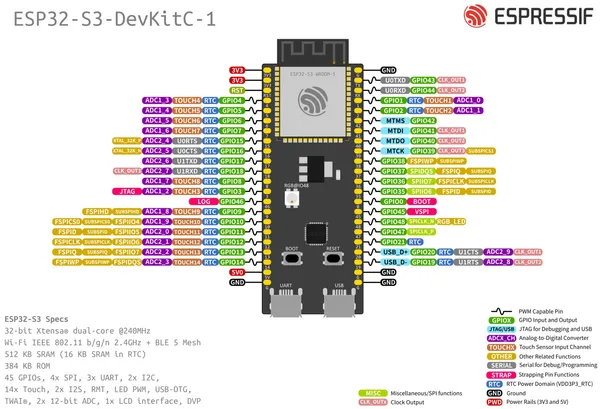
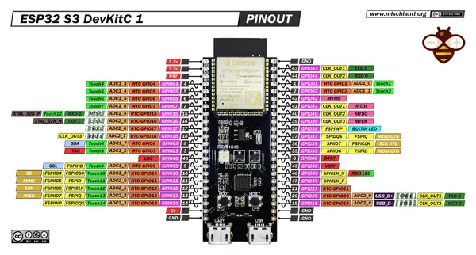

# ESP32-S3-DEVKITC-1

**Espressif** · ESP32-S3

Revision: Multiple source/revision records; see individual assets  
Coverage: Pinout image collected

[Browse all manufacturers](../../../../BROWSE.md) · [Desktop app](https://github.com/valleytechsolutions/black-wire-desktop)

## Manufacturer board pinout

**pinout image** · Reviewed source · JPG

[Open original reference](../../../../library/media/8e5671e714d017b110c4bbe40ffae93067070cde1805f471a79b15aa0d8275df.jpg)

**Credit and rights:** Not established; source attribution retained. Source/manufacturer: Espressif.

[Source 1](https://raw.githubusercontent.com/espressif/esp-dev-kits/ab7aff2e0c171e6918c88555b700798f36caeb67/docs/_static/esp32-s3-devkitc-1/ESP32-S3_DevKitC-1_pinlayout.jpg) · [Source 2](https://github.com/espressif/esp-dev-kits/blob/ab7aff2e0c171e6918c88555b700798f36caeb67/docs/_static/esp32-s3-devkitc-1/ESP32-S3_DevKitC-1_pinlayout.jpg)

Original image from the manufacturer documentation repository; exact commit recorded in source URL.

SHA-256: `8e5671e714d017b110c4bbe40ffae93067070cde1805f471a79b15aa0d8275df`

## Manufacturer board pinout

**pinout image** · Reviewed source · JPG

[Open original reference](../../../../library/media/3237fd9183a10d686a5bdd2268e40fb6f5624526a85132e717b8ada8b5cbdf7b.jpg)

**Credit and rights:** Not established; source attribution retained. Source/manufacturer: Espressif.

[Source 1](https://raw.githubusercontent.com/espressif/esp-dev-kits/ab7aff2e0c171e6918c88555b700798f36caeb67/docs/_static/esp32-s3-devkitc-1/ESP32-S3_DevKitC-1_pinlayout_v1.1.jpg) · [Source 2](https://github.com/espressif/esp-dev-kits/blob/ab7aff2e0c171e6918c88555b700798f36caeb67/docs/_static/esp32-s3-devkitc-1/ESP32-S3_DevKitC-1_pinlayout_v1.1.jpg)

Original image from the manufacturer documentation repository; exact commit recorded in source URL.

SHA-256: `3237fd9183a10d686a5bdd2268e40fb6f5624526a85132e717b8ada8b5cbdf7b`

## Pinout - Renzo Mischianti

**pinout image** · Reviewed source · JPG

[Open original reference](../../../../library/media/ba61b31fb9a494fa9ee67e512ad69260b9c1240b872626f791bc2b19a41d1d58.jpg)

**Credit and rights:** CC BY-NC-ND marking visible on image; exact license version and publication permissions not established. Source/manufacturer: Espressif.

[Source 1](https://mischianti.org/wp-content/uploads/2023/06/esp32-S3-DevKitC-1-original-pinout-low.jpg) · [Source 2](https://mischianti.org/esp32-s3-devkitc-1-high-resolution-pinout-and-specs/)

Original public image by Renzo Mischianti, unchanged. Diagram/model matching is visual, not electrical verification. Exact PCB layout and revision must match; no inference of compatibility with lookalike marketplace clones.

SHA-256: `ba61b31fb9a494fa9ee67e512ad69260b9c1240b872626f791bc2b19a41d1d58`

Pin assignments have not been independently electrically verified. Check board revision before wiring.
