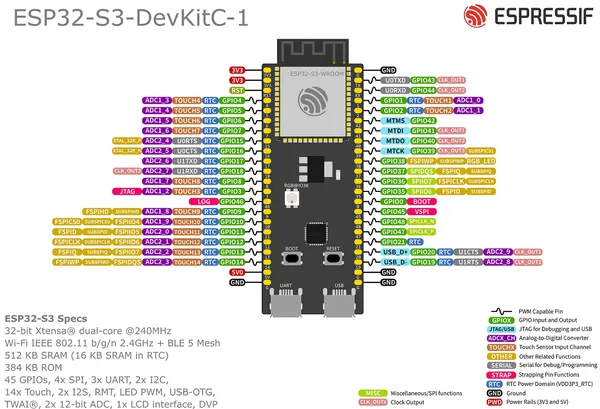

# ESP32-S3-DEVKITC-1 v1.1

**Espressif** · ESP32-S3

Revision: Source filename: ESP32-S3_DevKitC-1_pinlayout_v1.1.jpg  
Coverage: Pinout image collected

[Browse all manufacturers](../../../../BROWSE.md) · [Desktop app](https://github.com/valleytechsolutions/black-wire-desktop)

## Manufacturer board pin layout

**pinout image** · Reviewed source · JPG

[Open original reference](../../../../library/media/3237fd9183a10d686a5bdd2268e40fb6f5624526a85132e717b8ada8b5cbdf7b.jpg)

**Credit and rights:** Not established; source attribution retained. Source/manufacturer: Espressif.

[Source 1](https://raw.githubusercontent.com/espressif/esp-dev-kits/ab7aff2e0c171e6918c88555b700798f36caeb67/docs/_static/esp32-s3-devkitc-1/ESP32-S3_DevKitC-1_pinlayout_v1.1.jpg) · [Source 2](https://github.com/espressif/esp-dev-kits/blob/ab7aff2e0c171e6918c88555b700798f36caeb67/docs/_static/esp32-s3-devkitc-1/ESP32-S3_DevKitC-1_pinlayout_v1.1.jpg)

SHA-256: `3237fd9183a10d686a5bdd2268e40fb6f5624526a85132e717b8ada8b5cbdf7b`

Pin assignments have not been independently electrically verified. Check board revision before wiring.
