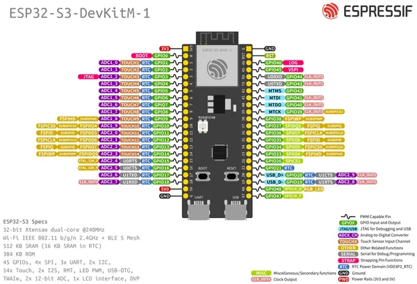

# ESP32-S3-DEVKITM-1

**Espressif** · ESP32-S3

Revision: Multiple source/revision records; see individual assets  
Coverage: Pinout image collected

[Browse all manufacturers](../../../../BROWSE.md) · [Desktop app](https://github.com/valleytechsolutions/black-wire-desktop)

## Manufacturer board pinout

**pinout image** · Reviewed source · JPG

[Open original reference](../../../../library/media/e2745a3112066d2d22b2088669c64f7c6b8e5dfd389afadc9ccb131ceb7c48e0.jpg)

**Credit and rights:** Not established; source attribution retained. Source/manufacturer: Espressif.

[Source 1](https://raw.githubusercontent.com/espressif/esp-dev-kits/ab7aff2e0c171e6918c88555b700798f36caeb67/docs/_static/esp32-s3-devkitm-1/ESP32-S3_DevKitM-1_pinlayout.jpg) · [Source 2](https://github.com/espressif/esp-dev-kits/blob/ab7aff2e0c171e6918c88555b700798f36caeb67/docs/_static/esp32-s3-devkitm-1/ESP32-S3_DevKitM-1_pinlayout.jpg)

Original image from the manufacturer documentation repository; exact commit recorded in source URL.

SHA-256: `e2745a3112066d2d22b2088669c64f7c6b8e5dfd389afadc9ccb131ceb7c48e0`

Pin assignments have not been independently electrically verified. Check board revision before wiring.
