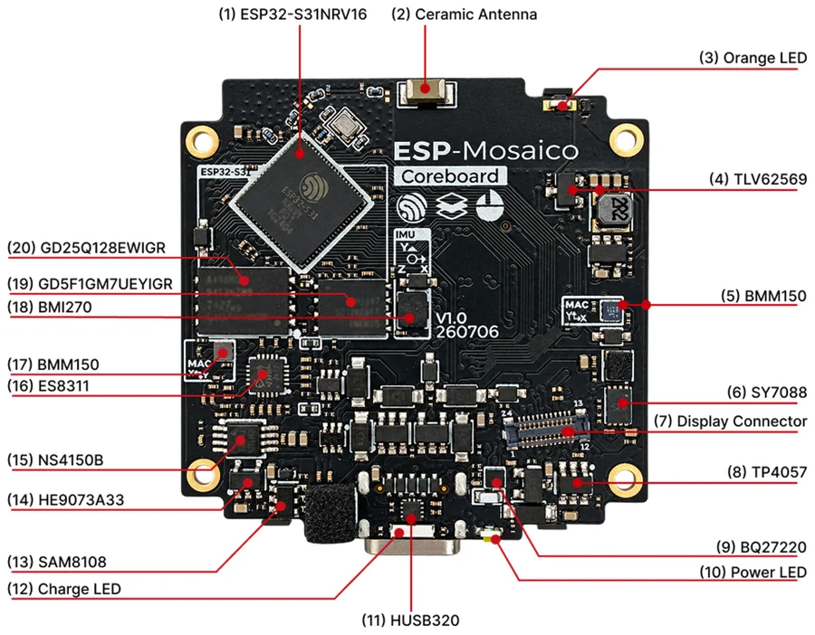
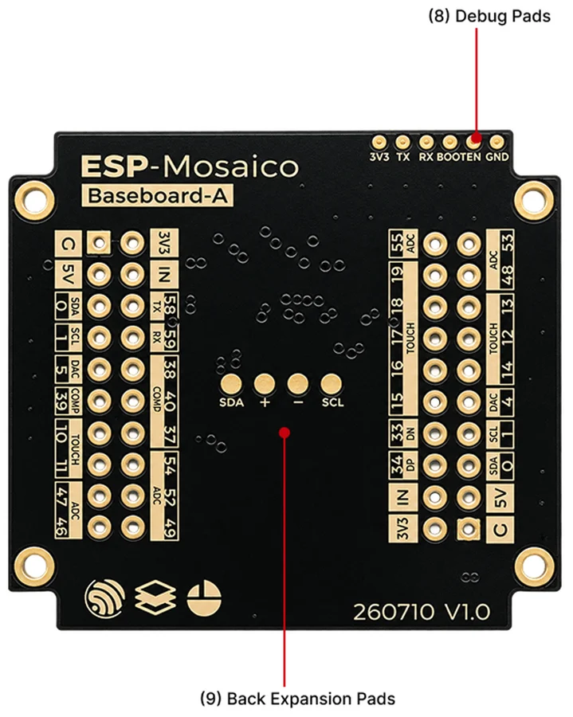
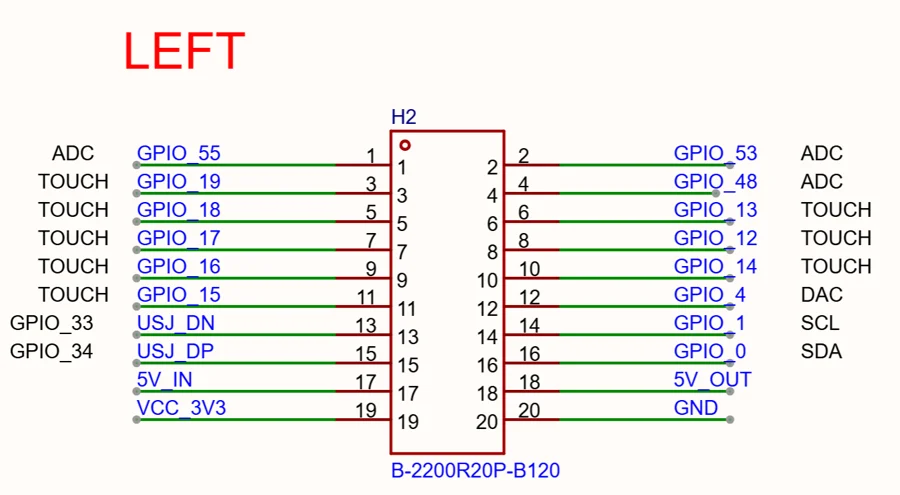
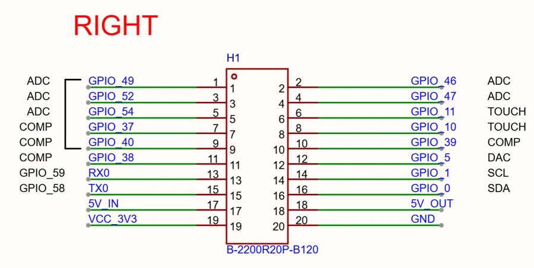

# ESP-Mosaico

**Espressif** · ESP32-S31

Revision: CoreBoard V1.0; schematic 2026-08-18

Coverage: Supporting documentation; physical pinout still needed

[Browse all manufacturers](../../../../BROWSE.md) · [Devices & IoT](../../../../DEVICES.md) · [Open in the browser guide](https://valleytech-black-wire-guide.pages.dev/?board=espressif-esp-mosaico)

Device category: **Displays & HMIs**

CoreBoard V1.0 only. H1 right slot is rotated 180 degrees relative to H2. H1 pins share audio functions. H2 GPIO19 is described as ADC in the HTML table but TOUCH in the connector schematic: that capability remains unresolved. Do not infer input-voltage ranges from output rails.

Architecture: **RISC-V**

## Datasheets and original documentation

Board datasheet: **not yet recorded**. Visual reference: **available**.

[Original manufacturer hardware documentation](https://docs.espressif.com/projects/esp-dev-kits/en/latest/esp32s31/esp-mosaico/user_guide.html)

- **hardware-guide / board**: [ESP-Mosaico CoreBoard V1.0 hardware guide](https://docs.espressif.com/projects/esp-dev-kits/en/latest/esp32s31/esp-mosaico/user_guide.html) · online
- **schematic / board**: [CoreBoard V1.0 schematic (2026-08-18)](https://dl.espressif.com/AE/SCH_SCH_ESP-Mosaico_CoreBoard_V1_0_2026-08-18.pdf) · [saved document](../../../../library/media/587853ee8493be2fc52b2cba347386febefe33fac51bb6b5a9a47f0067d6e213.pdf)

CoreBoard V1.0 only. H1 right slot is rotated 180 degrees relative to H2. H1 pins share audio functions. H2 GPIO19 is described as ADC in the HTML table but TOUCH in the connector schematic: that capability remains unresolved. Do not infer input-voltage ranges from output rails.

[Documentation coverage and remaining gaps](../../../../DOCUMENTATION.md)

## Specifications and hardware documentation

- [Manufacturer hardware documentation](https://docs.espressif.com/projects/esp-dev-kits/en/latest/esp32s31/esp-mosaico/user_guide.html)

## CoreBoard front components

**board labeling image** · Reviewed source · PNG

[Open original reference](../../../../library/media/3d71c355ebc20d7343b85609ab2a1309f9bc0500268ba7e9716f055501471389.png)

**Credit and rights:** Espressif / original contributors. Asset-specific redistribution and print rights have not been established. Original artwork is not relicensed by Black Wire's editorial license.. Source/manufacturer: Espressif.

[Source 1](https://docs.espressif.com/projects/esp-dev-kits/en/latest/esp32s31/_images/esp-mosaico-coreboard-front.png) · [Source 2](https://docs.espressif.com/projects/esp-dev-kits/en/latest/esp32s31/esp-mosaico/user_guide.html)

Component-location callouts, not a complete physical GPIO map.

Image revision: CoreBoard V1.0; schematic 2026-08-18

SHA-256: `3d71c355ebc20d7343b85609ab2a1309f9bc0500268ba7e9716f055501471389`

## BaseBoard back components

**board labeling image** · Reviewed source · PNG

[Open original reference](../../../../library/media/bcbe86c867103f076f8e53279164123562c1b0dc03c6c4e68bfa4c9f80938ede.png)

**Credit and rights:** Espressif / original contributors. Asset-specific redistribution and print rights have not been established. Original artwork is not relicensed by Black Wire's editorial license.. Source/manufacturer: Espressif.

[Source 1](https://docs.espressif.com/projects/esp-dev-kits/en/latest/esp32s31/_images/esp-mosaico-baseboard-back.png) · [Source 2](https://docs.espressif.com/projects/esp-dev-kits/en/latest/esp32s31/esp-mosaico/user_guide.html)

Component-location callouts, not a complete physical GPIO map.

Image revision: CoreBoard V1.0; schematic 2026-08-18

SHA-256: `bcbe86c867103f076f8e53279164123562c1b0dc03c6c4e68bfa4c9f80938ede`

## H2 left expansion connector schematic

**pin function reference** · Reviewed source · PNG

[Open original reference](../../../../library/media/52a10d7b2e3557960a63f6f31a50265059e57f934609b8e0e7d311cb9cf8eab4.png)

**Credit and rights:** Espressif / original contributors. Asset-specific redistribution and print rights have not been established. Original artwork is not relicensed by Black Wire's editorial license.. Source/manufacturer: Espressif.

[Source 1](https://docs.espressif.com/projects/esp-dev-kits/en/latest/esp32s31/_images/esp-mosaico-expansion-interface-left.png) · [Source 2](https://docs.espressif.com/projects/esp-dev-kits/en/latest/esp32s31/esp-mosaico/user_guide.html)

Manufacturer connector schematic; physical viewing side must be established from the hardware guide. H2 GPIO19 analog capability differs between the source table and schematic.

Image revision: CoreBoard V1.0; schematic 2026-08-18

SHA-256: `52a10d7b2e3557960a63f6f31a50265059e57f934609b8e0e7d311cb9cf8eab4`

## H1 right expansion connector schematic

**pin function reference** · Reviewed source · PNG

[Open original reference](../../../../library/media/bb293d46410c59e72de92d44964841fa9c185648068e6d7c0efc2770e348388c.png)

**Credit and rights:** Espressif / original contributors. Asset-specific redistribution and print rights have not been established. Original artwork is not relicensed by Black Wire's editorial license.. Source/manufacturer: Espressif.

[Source 1](https://docs.espressif.com/projects/esp-dev-kits/en/latest/esp32s31/_images/esp-mosaico-expansion-interface-right.png) · [Source 2](https://docs.espressif.com/projects/esp-dev-kits/en/latest/esp32s31/esp-mosaico/user_guide.html)

Manufacturer connector schematic; physical viewing side must be established from the hardware guide. H2 GPIO19 analog capability differs between the source table and schematic.

Image revision: CoreBoard V1.0; schematic 2026-08-18

SHA-256: `bb293d46410c59e72de92d44964841fa9c185648068e6d7c0efc2770e348388c`

## CoreBoard V1.0 schematic (2026-08-18)

**original reference PDF** · Reviewed source · PDF

[Open original reference](../../../../library/media/587853ee8493be2fc52b2cba347386febefe33fac51bb6b5a9a47f0067d6e213.pdf)

**Credit and rights:** Espressif / original contributors. Asset-specific redistribution and print rights have not been established. Original artwork is not relicensed by Black Wire's editorial license.. Source/manufacturer: Espressif.

[Source 1](https://dl.espressif.com/AE/SCH_SCH_ESP-Mosaico_CoreBoard_V1_0_2026-08-18.pdf) · [Source 2](https://docs.espressif.com/projects/esp-dev-kits/en/latest/esp32s31/esp-mosaico/user_guide.html)

Source reviewed for model and reference type; pin assignments are not independently electrically validated.

Image revision: CoreBoard V1.0; schematic 2026-08-18

SHA-256: `587853ee8493be2fc52b2cba347386febefe33fac51bb6b5a9a47f0067d6e213`

Pin assignments have not been independently electrically verified. Check board revision before wiring.
