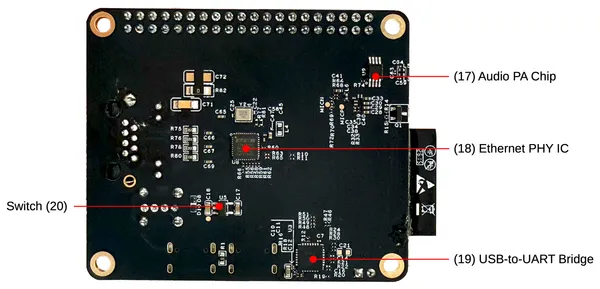
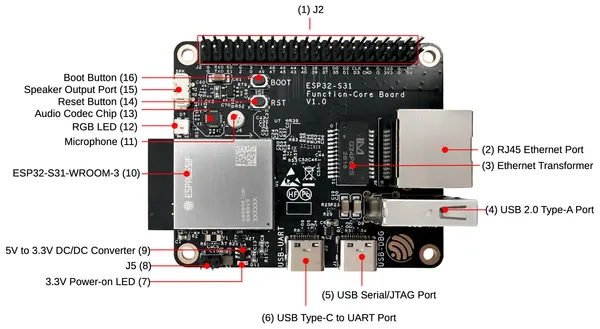

# ESP32-S31-FUNCTION-COREBOARD-1

**Espressif** · ESP32-S31

Revision: Multiple source/revision records; see individual assets  
Coverage: Board labels only; pinout needed

[Browse all manufacturers](../../../../BROWSE.md) · [Desktop app](https://github.com/valleytechsolutions/black-wire-desktop)

## Board component and connector locations

**board labeling image** · Reviewed source · PNG

[Open original reference](../../../../library/media/511af509dd6d10b1399b00d36377b30c205eb37ef8204d4aaa78ff8e9570fcb8.png)

**Credit and rights:** Not established; source attribution retained. Source/manufacturer: Espressif.

[Source 1](https://raw.githubusercontent.com/espressif/esp-dev-kits/ab7aff2e0c171e6918c88555b700798f36caeb67/docs/_static/esp32-s31-function-coreboard-1/esp32-s31-function-coreboard-1-annotated-photo-back.png) · [Source 2](https://github.com/espressif/esp-dev-kits/blob/ab7aff2e0c171e6918c88555b700798f36caeb67/docs/_static/esp32-s31-function-coreboard-1/esp32-s31-function-coreboard-1-annotated-photo-back.png)

SHA-256: `511af509dd6d10b1399b00d36377b30c205eb37ef8204d4aaa78ff8e9570fcb8`

## Board component and connector locations

**board labeling image** · Reviewed source · PNG

[Open original reference](../../../../library/media/e444f345e5eae00fd9de19c04f6cd439c21da975c1d9950744530ac460c28106.png)

**Credit and rights:** Not established; source attribution retained. Source/manufacturer: Espressif.

[Source 1](https://raw.githubusercontent.com/espressif/esp-dev-kits/ab7aff2e0c171e6918c88555b700798f36caeb67/docs/_static/esp32-s31-function-coreboard-1/esp32-s31-function-coreboard-1-annotated-photo-front.png) · [Source 2](https://github.com/espressif/esp-dev-kits/blob/ab7aff2e0c171e6918c88555b700798f36caeb67/docs/_static/esp32-s31-function-coreboard-1/esp32-s31-function-coreboard-1-annotated-photo-front.png)

SHA-256: `e444f345e5eae00fd9de19c04f6cd439c21da975c1d9950744530ac460c28106`

Pin assignments have not been independently electrically verified. Check board revision before wiring.
