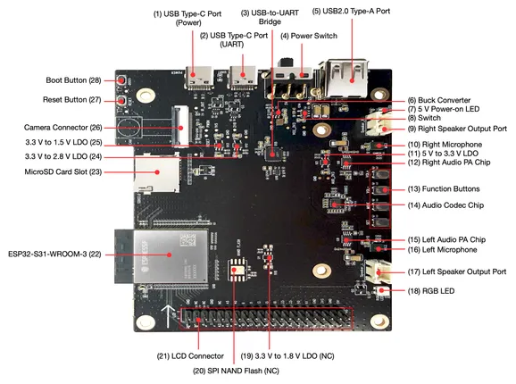

# ESP32-S31-KORVO-1

**Espressif** · ESP32-S31

Revision: Source filename: esp32-s31-korvo-1-callouts.png

Coverage: Board labels only; pinout needed

[Browse all manufacturers](../../../../BROWSE.md) · [Devices & IoT](../../../../DEVICES.md) · [Open in the browser guide](https://valleytech-black-wire-guide.pages.dev/?board=espressif-esp32-esp32-s31-korvo-1)

## Datasheets and original documentation

Board datasheet: **not yet recorded**. Visual reference: **available**.

Original manufacturer website still needs identification.

A chip datasheet, schematic and board datasheet have different scopes. Match the exact hardware revision.

[Documentation coverage and remaining gaps](../../../../DOCUMENTATION.md)

## Board component and connector locations

**board labeling image** · Reviewed source · PNG

[Open original reference](../../../../library/media/9cba01afe871e814fd2ab76ef650fb0b211422c64df31512cb0f89fd739af168.png)

**Credit and rights:** Not established; source attribution retained. Source/manufacturer: Espressif.

[Source 1](https://raw.githubusercontent.com/espressif/esp-dev-kits/ab7aff2e0c171e6918c88555b700798f36caeb67/docs/_static/esp32-s31-korvo-1/esp32-s31-korvo-1-callouts.png) · [Source 2](https://github.com/espressif/esp-dev-kits/blob/ab7aff2e0c171e6918c88555b700798f36caeb67/docs/_static/esp32-s31-korvo-1/esp32-s31-korvo-1-callouts.png)

Image revision: Source filename: esp32-s31-korvo-1-callouts.png

SHA-256: `9cba01afe871e814fd2ab76ef650fb0b211422c64df31512cb0f89fd739af168`

Pin assignments have not been independently electrically verified. Check board revision before wiring.
