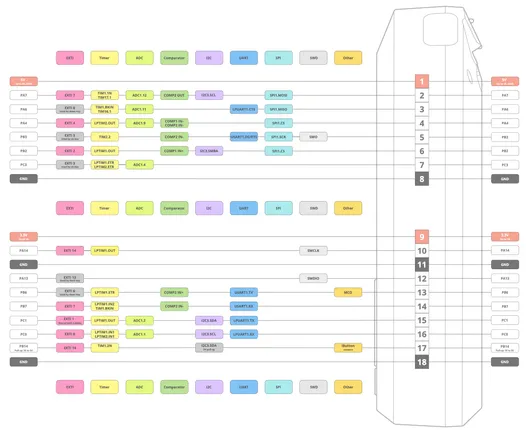

# Flipper Zero

**Flipper Devices** · STM32WB55

Revision: Not identified  
Coverage: Pinout image collected

[Browse all manufacturers](../../../../BROWSE.md) · [Desktop app](https://github.com/valleytechsolutions/black-wire-desktop)

## GPIO pinout v2

**pinout image** · Reviewed source · JPG

[Open original reference](../../../../library/media/493bec315a31038ad4c5d3c234b531bb5417a726e997eddd996c704407edc793.jpg)

**Credit and rights:** Not established; source attribution retained. Source/manufacturer: Flipper Devices.

[Source 1](https://cdn.flipper.net/Flipper_Zero_GPIO_Pinout_v2.jpg) · [Source 2](https://flipper.net/)

SHA-256: `493bec315a31038ad4c5d3c234b531bb5417a726e997eddd996c704407edc793`

Pin assignments have not been independently electrically verified. Check board revision before wiring.
