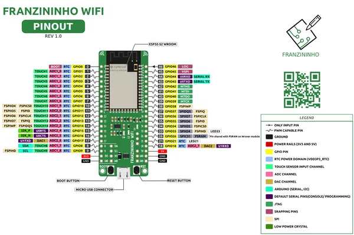

# Franzininho WiFi Wroom

**Franzininho** · ESP32-S2

Revision: Not identified  
Coverage: Pinout image collected

[Browse all manufacturers](../../../../BROWSE.md) · [Desktop app](https://github.com/valleytechsolutions/black-wire-desktop)

## Physical board pinout

**pinout image** · Reviewed source · PNG

[Open original reference](../../../../library/media/b777857fcc6f94f7e4ed9e5c0d8505893f75c3a89af6210e6916dcb415015bf1.png)

**Credit and rights:** Not established; source attribution retained. Source/manufacturer: Franzininho.

[Source 1](https://raw.githubusercontent.com/Franzininho/Franzininho-WiFi/main/img/pinagem-franzininho-wifi.png) · [Source 2](https://github.com/Franzininho/Franzininho-WIFI)

Discovered from CircuitPython board metadata and the linked product/documentation page. Exact hardware revision requires matching to the diagram. Page is shared with: Franzininho WiFi Wrover.

SHA-256: `b777857fcc6f94f7e4ed9e5c0d8505893f75c3a89af6210e6916dcb415015bf1`

Pin assignments have not been independently electrically verified. Check board revision before wiring.
