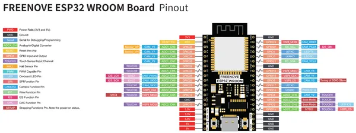

# ESP32 WROOM Board

**Freenove** · ESP32 original

Revision: Not identified  
Coverage: Pinout image collected

[Browse all manufacturers](../../../../BROWSE.md) · [Desktop app](https://github.com/valleytechsolutions/black-wire-desktop)

## Official pinout

**pinout image** · Reviewed source · PNG

[Open original reference](../../../../library/media/fc9f2fa75f6dd0e2d629853521551356b5f0a6f7589013996e76dc68d6a6dd58.png)

**Credit and rights:** Not established; source attribution retained. Source/manufacturer: Freenove.

[Source 1](https://raw.githubusercontent.com/Freenove/Freenove_ESP32_WROOM_Board/3f274abe62d418c7fd73c645eb5697a4e4801c0f/Freenove_ESP32_WROOM_Board_Pinout.png) · [Source 2](https://github.com/Freenove/Freenove_ESP32_WROOM_Board/blob/3f274abe62d418c7fd73c645eb5697a4e4801c0f/Freenove_ESP32_WROOM_Board_Pinout.png)

Manufacturer source. Pinouts must match the exact board and revision; Freenove documents changes between layouts. The diagram depicts the development board itself; it is not a full pinout of any kit carrier, speaker, display or other accessory.

SHA-256: `fc9f2fa75f6dd0e2d629853521551356b5f0a6f7589013996e76dc68d6a6dd58`

## Official pinout

**original reference PDF** · Reviewed source · PDF

[Open original reference](../../../../library/media/6a607154fcfe54627ce39f17194852feb6a51f4ebb06fd2291f14c6cfca945f7.pdf)

**Credit and rights:** Not established; source attribution retained. Source/manufacturer: Freenove.

[Source 1](https://raw.githubusercontent.com/Freenove/Freenove_ESP32_WROOM_Board/3f274abe62d418c7fd73c645eb5697a4e4801c0f/Datasheet/Freenove_ESP32_WROOM_Board_Pinout.pdf) · [Source 2](https://github.com/Freenove/Freenove_ESP32_WROOM_Board/blob/3f274abe62d418c7fd73c645eb5697a4e4801c0f/Datasheet/Freenove_ESP32_WROOM_Board_Pinout.pdf)

Manufacturer source. Pinouts must match the exact board and revision; Freenove documents changes between layouts. The diagram depicts the development board itself; it is not a full pinout of any kit carrier, speaker, display or other accessory.

SHA-256: `6a607154fcfe54627ce39f17194852feb6a51f4ebb06fd2291f14c6cfca945f7`

Pin assignments have not been independently electrically verified. Check board revision before wiring.
