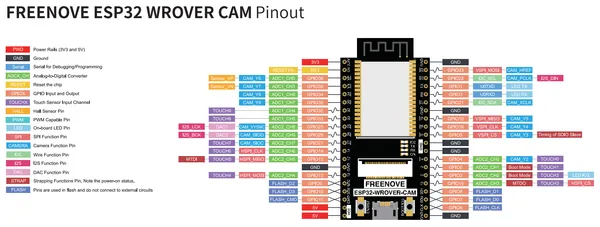

# ESP32 WROVER Board v1.6

**Freenove** · ESP32 original

Revision: v1.6  
Coverage: Pinout image collected

[Browse all manufacturers](../../../../BROWSE.md) · [Desktop app](https://github.com/valleytechsolutions/black-wire-desktop)

## Pinout v1.6

**pinout image** · Reviewed source · PNG

[Open original reference](../../../../library/media/24ef887b18ec3d9db5bd8183c97be3662bd4190e5e6bf25439e8602e9bf418fc.png)

**Credit and rights:** Not established; source attribution retained. Source/manufacturer: Freenove.

[Source 1](https://raw.githubusercontent.com/Freenove/Freenove_ESP32_WROVER_Board/89e7ad4ca067a991f185e06a7b2a63c2e96a7cb7/ESP32_Pinout_1.6.png) · [Source 2](https://github.com/Freenove/Freenove_ESP32_WROVER_Board/blob/89e7ad4ca067a991f185e06a7b2a63c2e96a7cb7/ESP32_Pinout_1.6.png)

Manufacturer source. Pinouts must match the exact board and revision; Freenove documents changes between layouts. The diagram depicts the development board itself; it is not a full pinout of any kit carrier, speaker, display or other accessory.

SHA-256: `24ef887b18ec3d9db5bd8183c97be3662bd4190e5e6bf25439e8602e9bf418fc`

## Pinout v1.6

**original reference PDF** · Reviewed source · PDF

[Open original reference](../../../../library/media/9556429625f7a9bc0becd0e73162c2485d8ee3c284a754889be9a60189a3086c.pdf)

**Credit and rights:** Not established; source attribution retained. Source/manufacturer: Freenove.

[Source 1](https://raw.githubusercontent.com/Freenove/Freenove_ESP32_WROVER_Board/89e7ad4ca067a991f185e06a7b2a63c2e96a7cb7/Datasheet/ESP32-Pinout_V1.6.pdf) · [Source 2](https://github.com/Freenove/Freenove_ESP32_WROVER_Board/blob/89e7ad4ca067a991f185e06a7b2a63c2e96a7cb7/Datasheet/ESP32-Pinout_V1.6.pdf)

Manufacturer source. Pinouts must match the exact board and revision; Freenove documents changes between layouts. The diagram depicts the development board itself; it is not a full pinout of any kit carrier, speaker, display or other accessory.

SHA-256: `9556429625f7a9bc0becd0e73162c2485d8ee3c284a754889be9a60189a3086c`

Pin assignments have not been independently electrically verified. Check board revision before wiring.
