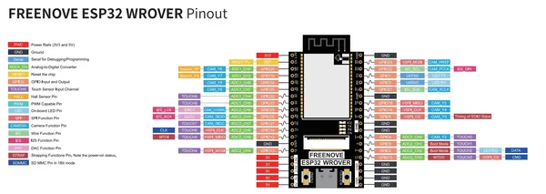

# ESP32 WROVER Board v3.0

**Freenove** · ESP32 original

Revision: v3.0  
Coverage: Pinout image collected

[Browse all manufacturers](../../../../BROWSE.md) · [Desktop app](https://github.com/valleytechsolutions/black-wire-desktop)

## Pinout v3.0

**pinout image** · Reviewed source · JPG

[Open original reference](../../../../library/media/68b3fc88405672a721f7fa9212210a45cc83fe2119640eb64e1dab0bdbd6e6e0.jpg)

**Credit and rights:** Not established; source attribution retained. Source/manufacturer: Freenove.

[Source 1](https://raw.githubusercontent.com/Freenove/Freenove_ESP32_WROVER_Board/89e7ad4ca067a991f185e06a7b2a63c2e96a7cb7/ESP32_Pinout_V3.0.png) · [Source 2](https://github.com/Freenove/Freenove_ESP32_WROVER_Board/blob/89e7ad4ca067a991f185e06a7b2a63c2e96a7cb7/ESP32_Pinout_V3.0.png)

Manufacturer source. Pinouts must match the exact board and revision; Freenove documents changes between layouts. The diagram depicts the development board itself; it is not a full pinout of any kit carrier, speaker, display or other accessory.

SHA-256: `68b3fc88405672a721f7fa9212210a45cc83fe2119640eb64e1dab0bdbd6e6e0`

## Pinout v3.0

**original reference PDF** · Reviewed source · PDF

[Open original reference](../../../../library/media/a058825d5e80af7246529a83aa70f104c946942a6d715ec24e5973fae08e9670.pdf)

**Credit and rights:** Not established; source attribution retained. Source/manufacturer: Freenove.

[Source 1](https://raw.githubusercontent.com/Freenove/Freenove_ESP32_WROVER_Board/89e7ad4ca067a991f185e06a7b2a63c2e96a7cb7/Datasheet/ESP32-Pinout_V3.0.pdf) · [Source 2](https://github.com/Freenove/Freenove_ESP32_WROVER_Board/blob/89e7ad4ca067a991f185e06a7b2a63c2e96a7cb7/Datasheet/ESP32-Pinout_V3.0.pdf)

Manufacturer source. Pinouts must match the exact board and revision; Freenove documents changes between layouts. The diagram depicts the development board itself; it is not a full pinout of any kit carrier, speaker, display or other accessory.

SHA-256: `a058825d5e80af7246529a83aa70f104c946942a6d715ec24e5973fae08e9670`

Pin assignments have not been independently electrically verified. Check board revision before wiring.
