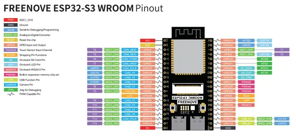
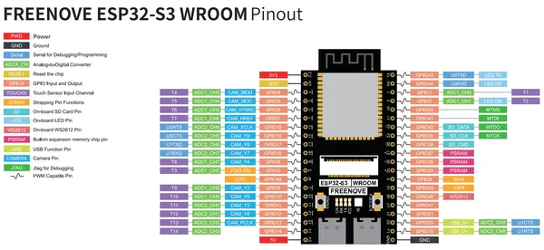

# ESP32-S3 WROOM Board

**Freenove** · ESP32-S3

Revision: Not identified  
Coverage: Pinout image collected

[Browse all manufacturers](../../../../BROWSE.md) · [Desktop app](https://github.com/valleytechsolutions/black-wire-desktop)

## Pinout - Development Kit source

**pinout image** · Reviewed source · PNG

[Open original reference](../../../../library/media/a7b5860aa02bf25d39ee2b85e4cd6676fb33033927d316e4653b82fe9da3b3c8.png)

**Credit and rights:** Not established; source attribution retained. Source/manufacturer: Freenove.

[Source 1](https://raw.githubusercontent.com/Freenove/Freenove_Development_Kit_for_ESP32_S3/ef2a296917f542bb81d5b65a31f43ed7ad5835f6/ESP32S3_Pinout.png) · [Source 2](https://github.com/Freenove/Freenove_Development_Kit_for_ESP32_S3/blob/ef2a296917f542bb81d5b65a31f43ed7ad5835f6/ESP32S3_Pinout.png)

Manufacturer source. Pinouts must match the exact board and revision; Freenove documents changes between layouts. The diagram depicts the development board itself; it is not a full pinout of any kit carrier, speaker, display or other accessory.

SHA-256: `a7b5860aa02bf25d39ee2b85e4cd6676fb33033927d316e4653b82fe9da3b3c8`

## Official pinout

**pinout image** · Reviewed source · PNG

[Open original reference](../../../../library/media/e3f297e2c9c14f941a0784b13d1195a24d0c2360663f486946453356e4e1df6e.png)

**Credit and rights:** Not established; source attribution retained. Source/manufacturer: Freenove.

[Source 1](https://raw.githubusercontent.com/Freenove/Freenove_ESP32_S3_WROOM_Board/3563960643987e327a9213c90566fca1e8c5ab67/ESP32S3_Pinout.png) · [Source 2](https://github.com/Freenove/Freenove_ESP32_S3_WROOM_Board/blob/3563960643987e327a9213c90566fca1e8c5ab67/ESP32S3_Pinout.png)

Manufacturer source. Pinouts must match the exact board and revision; Freenove documents changes between layouts. The diagram depicts the development board itself; it is not a full pinout of any kit carrier, speaker, display or other accessory.

SHA-256: `e3f297e2c9c14f941a0784b13d1195a24d0c2360663f486946453356e4e1df6e`

## Pinout - Development Kit source

**original reference PDF** · Reviewed source · PDF

[Open original reference](../../../../library/media/28f01637d2b0446f6ed2dcfcb2914e286fc40a2410477862f45d1c621ce32d54.pdf)

**Credit and rights:** Not established; source attribution retained. Source/manufacturer: Freenove.

[Source 1](https://raw.githubusercontent.com/Freenove/Freenove_Development_Kit_for_ESP32_S3/ef2a296917f542bb81d5b65a31f43ed7ad5835f6/Datasheet/ESP32-S3%20Pinout.pdf) · [Source 2](https://github.com/Freenove/Freenove_Development_Kit_for_ESP32_S3/blob/ef2a296917f542bb81d5b65a31f43ed7ad5835f6/Datasheet/ESP32-S3%20Pinout.pdf)

Manufacturer source. Pinouts must match the exact board and revision; Freenove documents changes between layouts. The diagram depicts the development board itself; it is not a full pinout of any kit carrier, speaker, display or other accessory.

SHA-256: `28f01637d2b0446f6ed2dcfcb2914e286fc40a2410477862f45d1c621ce32d54`

## Official pinout

**original reference PDF** · Reviewed source · PDF

[Open original reference](../../../../library/media/7497ed2ada24b3bfc9d8fd4188d62559b8eb5951795246327134edd92d9a25bc.pdf)

**Credit and rights:** Not established; source attribution retained. Source/manufacturer: Freenove.

[Source 1](https://raw.githubusercontent.com/Freenove/Freenove_ESP32_S3_WROOM_Board/3563960643987e327a9213c90566fca1e8c5ab67/Datasheet/ESP32-S3%20Pinout.pdf) · [Source 2](https://github.com/Freenove/Freenove_ESP32_S3_WROOM_Board/blob/3563960643987e327a9213c90566fca1e8c5ab67/Datasheet/ESP32-S3%20Pinout.pdf)

Manufacturer source. Pinouts must match the exact board and revision; Freenove documents changes between layouts. The diagram depicts the development board itself; it is not a full pinout of any kit carrier, speaker, display or other accessory.

SHA-256: `7497ed2ada24b3bfc9d8fd4188d62559b8eb5951795246327134edd92d9a25bc`

Pin assignments have not been independently electrically verified. Check board revision before wiring.
