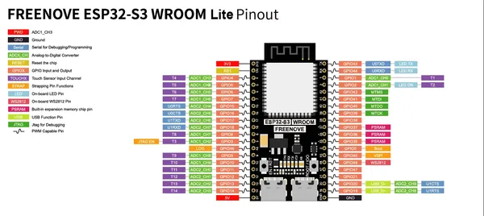

# ESP32-S3 WROOM Board Lite

**Freenove** · ESP32-S3

Revision: Not identified  
Coverage: Pinout image collected

[Browse all manufacturers](../../../../BROWSE.md) · [Desktop app](https://github.com/valleytechsolutions/black-wire-desktop)

## Official pinout

**pinout image** · Reviewed source · JPG

[Open original reference](../../../../library/media/1196b3f207c148f3394ebdf5b3325d038f35445b9738891b6b845209d82ec7c1.jpg)

**Credit and rights:** Not established; source attribution retained. Source/manufacturer: Freenove.

[Source 1](https://raw.githubusercontent.com/Freenove/Freenove_ESP32_S3_WROOM_Board_Lite/6f1f33bf0fc1e37f2c4edfa73291d92037d89ca5/ESP32S3_Lite_Pinout.png) · [Source 2](https://github.com/Freenove/Freenove_ESP32_S3_WROOM_Board_Lite/blob/6f1f33bf0fc1e37f2c4edfa73291d92037d89ca5/ESP32S3_Lite_Pinout.png)

Manufacturer source. Pinouts must match the exact board and revision; Freenove documents changes between layouts. The diagram depicts the development board itself; it is not a full pinout of any kit carrier, speaker, display or other accessory.

SHA-256: `1196b3f207c148f3394ebdf5b3325d038f35445b9738891b6b845209d82ec7c1`

## Official pinout

**original reference PDF** · Reviewed source · PDF

[Open original reference](../../../../library/media/3ef496bb684e83ef8d271541ed8b941123459616da1bd441b5273ecc116e3025.pdf)

**Credit and rights:** Not established; source attribution retained. Source/manufacturer: Freenove.

[Source 1](https://raw.githubusercontent.com/Freenove/Freenove_ESP32_S3_WROOM_Board_Lite/6f1f33bf0fc1e37f2c4edfa73291d92037d89ca5/Datasheet/ESP32S3_Lite_Pinout.pdf) · [Source 2](https://github.com/Freenove/Freenove_ESP32_S3_WROOM_Board_Lite/blob/6f1f33bf0fc1e37f2c4edfa73291d92037d89ca5/Datasheet/ESP32S3_Lite_Pinout.pdf)

Manufacturer source. Pinouts must match the exact board and revision; Freenove documents changes between layouts. The diagram depicts the development board itself; it is not a full pinout of any kit carrier, speaker, display or other accessory.

SHA-256: `3ef496bb684e83ef8d271541ed8b941123459616da1bd441b5273ecc116e3025`

Pin assignments have not been independently electrically verified. Check board revision before wiring.
