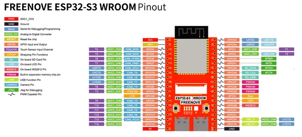

# ESP32-S3 WROOM Board (Media Kit red PCB)

**Freenove** · ESP32-S3

Revision: Red PCB shown; exact revision not identified  
Coverage: Pinout image collected

[Browse all manufacturers](../../../../BROWSE.md) · [Desktop app](https://github.com/valleytechsolutions/black-wire-desktop)

## Pinout - Media Kit source

**pinout image** · Reviewed source · PNG

[Open original reference](../../../../library/media/0c6b32ed44287a6f698260f6f1b8b67afabbf0fdb11d56afde455816028f2b0f.png)

**Credit and rights:** Not established; source attribution retained. Source/manufacturer: Freenove.

[Source 1](https://raw.githubusercontent.com/Freenove/Freenove_Media_Kit_for_ESP32-S3/fce6e8009f6289ce4956e2516fd7dfa863fb9db4/ESP32S3_Pinout.png) · [Source 2](https://github.com/Freenove/Freenove_Media_Kit_for_ESP32-S3/blob/fce6e8009f6289ce4956e2516fd7dfa863fb9db4/ESP32S3_Pinout.png)

Manufacturer source. Pinouts must match the exact board and revision; Freenove documents changes between layouts. The diagram depicts the development board itself; it is not a full pinout of any kit carrier, speaker, display or other accessory.

SHA-256: `0c6b32ed44287a6f698260f6f1b8b67afabbf0fdb11d56afde455816028f2b0f`

## Pinout - Media Kit source

**original reference PDF** · Reviewed source · PDF

[Open original reference](../../../../library/media/28f01637d2b0446f6ed2dcfcb2914e286fc40a2410477862f45d1c621ce32d54.pdf)

**Credit and rights:** Not established; source attribution retained. Source/manufacturer: Freenove.

[Source 1](https://raw.githubusercontent.com/Freenove/Freenove_Media_Kit_for_ESP32-S3/fce6e8009f6289ce4956e2516fd7dfa863fb9db4/Datasheet/ESP32-S3%20Pinout.pdf) · [Source 2](https://github.com/Freenove/Freenove_Media_Kit_for_ESP32-S3/blob/fce6e8009f6289ce4956e2516fd7dfa863fb9db4/Datasheet/ESP32-S3%20Pinout.pdf)

Manufacturer source. Pinouts must match the exact board and revision; Freenove documents changes between layouts. The diagram depicts the development board itself; it is not a full pinout of any kit carrier, speaker, display or other accessory.

SHA-256: `28f01637d2b0446f6ed2dcfcb2914e286fc40a2410477862f45d1c621ce32d54`

Pin assignments have not been independently electrically verified. Check board revision before wiring.
