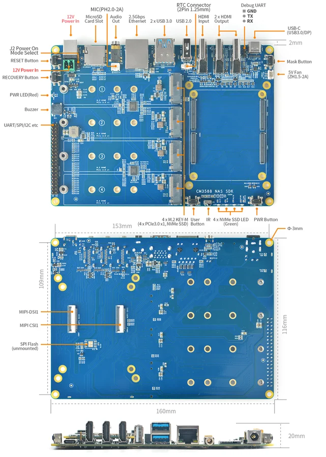

# CM3588 NAS Kit

**FriendlyELEC** · Expansion

Revision: Multiple source revisions; match each reference filename

Coverage: Supporting references collected; physical GPIO map still needed

[Browse all manufacturers](../../../../BROWSE.md) · [Devices & IoT](../../../../DEVICES.md) · [Open in the browser guide](https://valleytech-black-wire-guide.pages.dev/?board=friendlyelec-cm3588-nas-kit)

## Datasheets and original documentation

Board datasheet: **not yet recorded**. Visual reference: **available**.

[Original manufacturer hardware website](https://wiki.friendlyelec.com/wiki/index.php/CM3588_NAS_Kit)

- **hardware-guide / board**: [Manufacturer hardware manual and specifications](https://wiki.friendlyelec.com/wiki/index.php/CM3588_NAS_Kit) · online
- **schematic / board**: [CM3588_NAS_SDK_2309_SCH.PDF](https://wiki.friendlyelec.com/wiki/images/1/15/CM3588_NAS_SDK_2309_SCH.PDF) · online

Match the exact board, carrier and PCB revision. A component datasheet does not define the board header or input-power limits.

[Documentation coverage and remaining gaps](../../../../DOCUMENTATION.md)

## Specifications and hardware documentation

- [Manufacturer specifications & hardware guide](https://wiki.friendlyelec.com/wiki/index.php/CM3588_NAS_Kit)

## CM3588_NAS_SDK_Carrier_board_layout.jpg

**board labeling image** · Reviewed source · JPG

[Open original reference](../../../../library/media/0702dbceb30e59de7a8427b837726eafcc889216a2c5f214a0bb726bbb37254d.jpg)

**Credit and rights:** FriendlyELEC / original reference contributors. Asset-specific redistribution and print rights have not been established. Original artwork is not relicensed by the Black Wire editorial license.. Source/manufacturer: FriendlyELEC.

[Source 1](https://wiki.friendlyelec.com/wiki/images/c/c3/CM3588_NAS_SDK_Carrier_board_layout.jpg) · [Source 2](https://wiki.friendlyelec.com/wiki/index.php/CM3588_NAS_Kit)

Labeled board and connector locations. This is not a per-pin signal map.

Image revision: CM3588_NAS_SDK_Carrier_board_layout.jpg

SHA-256: `0702dbceb30e59de7a8427b837726eafcc889216a2c5f214a0bb726bbb37254d`

Pin assignments have not been independently electrically verified. Check board revision before wiring.
