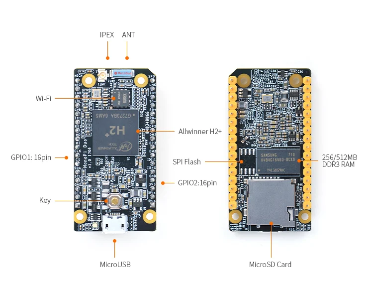
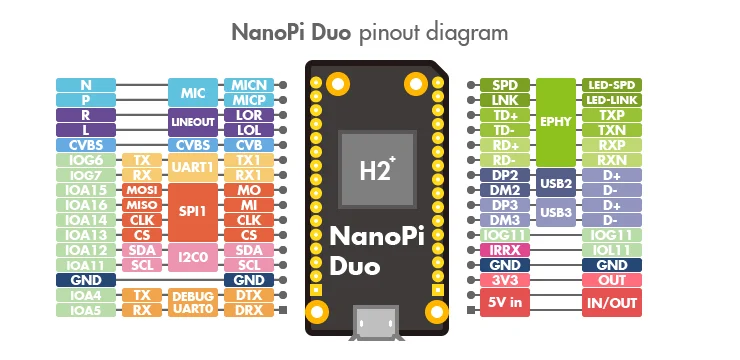

# NanoPi Duo

**FriendlyELEC** · H2+

Revision: Multiple source revisions; match each reference filename

Coverage: Physical pinout source collected; check exact connector scope and revision

[Browse all manufacturers](../../../../BROWSE.md) · [Devices & IoT](../../../../DEVICES.md) · [Open in the browser guide](https://valleytech-black-wire-guide.pages.dev/?board=friendlyelec-nanopi-duo)

Architecture: **ARM**

## Datasheets and original documentation

Board datasheet: **not yet recorded**. Visual reference: **available**.

[Original manufacturer hardware website](https://wiki.friendlyelec.com/wiki/index.php/NanoPi_Duo)

- **hardware-guide / board**: [Manufacturer hardware manual and specifications](https://wiki.friendlyelec.com/wiki/index.php/NanoPi_Duo) · online
- **schematic / board**: [Schematic_NanoPi_Duo-v1.1.pdf](https://wiki.friendlyelec.com/wiki/images/8/8a/Schematic_NanoPi_Duo-v1.1.pdf) · online
- **schematic / board**: [Schematic_NanoPi_Duo-V1.0_1706.pdf](https://wiki.friendlyelec.com/wiki/images/9/9a/Schematic_NanoPi_Duo-V1.0_1706.pdf) · online

Match the exact board, carrier and PCB revision. A component datasheet does not define the board header or input-power limits.

[Documentation coverage and remaining gaps](../../../../DOCUMENTATION.md)

## Specifications and hardware documentation

- [Manufacturer specifications & hardware guide](https://wiki.friendlyelec.com/wiki/index.php/NanoPi_Duo)

## NanoPi-Duo-layout.jpg

**board labeling image** · Reviewed source · JPG

[Open original reference](../../../../library/media/a8b78e3b094b6c9bed19f82d92378af339ae35d37d64524be424fe10c6bf326b.jpg)

**Credit and rights:** FriendlyELEC / original reference contributors. Asset-specific redistribution and print rights have not been established. Original artwork is not relicensed by the Black Wire editorial license.. Source/manufacturer: FriendlyELEC.

[Source 1](https://wiki.friendlyelec.com/wiki/images/0/0d/NanoPi-Duo-layout.jpg) · [Source 2](https://wiki.friendlyelec.com/wiki/index.php/NanoPi_Duo)

Labeled board and connector locations. This is not a per-pin signal map.

Image revision: NanoPi-Duo-layout.jpg

SHA-256: `a8b78e3b094b6c9bed19f82d92378af339ae35d37d64524be424fe10c6bf326b`

## Duo_pinout-02.jpg

**pinout image** · Reviewed source · JPG

[Open original reference](../../../../library/media/5b8978a99b2cfae89a3faca78ced6d7b3143b45e9bd170f5f725e0691246cee2.jpg)

**Credit and rights:** FriendlyELEC / original reference contributors. Asset-specific redistribution and print rights have not been established. Original artwork is not relicensed by the Black Wire editorial license.. Source/manufacturer: FriendlyELEC.

[Source 1](https://wiki.friendlyelec.com/wiki/images/3/30/Duo_pinout-02.jpg) · [Source 2](https://wiki.friendlyelec.com/wiki/index.php/NanoPi_Duo)

Physical connector map from the manufacturer. Verify PCB revision and each connector scope before wiring.

Image revision: Revision not printed on diagram

SHA-256: `5b8978a99b2cfae89a3faca78ced6d7b3143b45e9bd170f5f725e0691246cee2`

Pin assignments have not been independently electrically verified. Check board revision before wiring.
