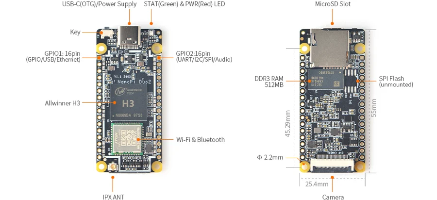
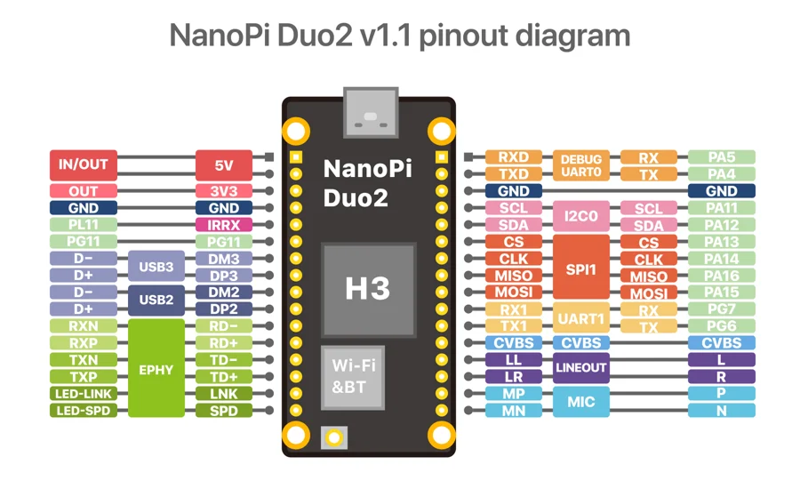

# NanoPi Duo2

**FriendlyELEC** · H3

Revision: Multiple source revisions; match each reference filename

Coverage: Physical pinout source collected; check exact connector scope and revision

[Browse all manufacturers](../../../../BROWSE.md) · [Devices & IoT](../../../../DEVICES.md) · [Open in the browser guide](https://valleytech-black-wire-guide.pages.dev/?board=friendlyelec-nanopi-duo2)

Architecture: **ARM**

## Datasheets and original documentation

Board datasheet: **not yet recorded**. Visual reference: **available**.

[Original manufacturer hardware website](https://wiki.friendlyelec.com/wiki/index.php/NanoPi_Duo2)

- **hardware-guide / board**: [Manufacturer hardware manual and specifications](https://wiki.friendlyelec.com/wiki/index.php/NanoPi_Duo2) · online
- **schematic / board**: [NanoPi_Duo2_V1_1_2405_SCH.PDF](https://wiki.friendlyelec.com/wiki/images/6/66/NanoPi_Duo2_V1_1_2405_SCH.PDF) · online

Match the exact board, carrier and PCB revision. A component datasheet does not define the board header or input-power limits.

[Documentation coverage and remaining gaps](../../../../DOCUMENTATION.md)

## Specifications and hardware documentation

- [Manufacturer specifications & hardware guide](https://wiki.friendlyelec.com/wiki/index.php/NanoPi_Duo2)

## NanoPi-Duo2-layout.jpg

**board labeling image** · Reviewed source · JPG

[Open original reference](../../../../library/media/071e69502c8b233e00aa63ff1329c0002a479b7104600632d41ddfcddf0c1107.jpg)

**Credit and rights:** FriendlyELEC / original reference contributors. Asset-specific redistribution and print rights have not been established. Original artwork is not relicensed by the Black Wire editorial license.. Source/manufacturer: FriendlyELEC.

[Source 1](https://wiki.friendlyelec.com/wiki/images/d/dd/NanoPi-Duo2-layout.jpg) · [Source 2](https://wiki.friendlyelec.com/wiki/index.php/NanoPi_Duo2)

Labeled board and connector locations. This is not a per-pin signal map.

Image revision: NanoPi-Duo2-layout.jpg

SHA-256: `071e69502c8b233e00aa63ff1329c0002a479b7104600632d41ddfcddf0c1107`

## Duo_pinout2-02.jpg

**pinout image** · Reviewed source · JPG

[Open original reference](../../../../library/media/3c148f3e7472b1a55b35ae96efb43c5d006378c53d4ffc093c1d86f41d9164a1.jpg)

**Credit and rights:** FriendlyELEC / original reference contributors. Asset-specific redistribution and print rights have not been established. Original artwork is not relicensed by the Black Wire editorial license.. Source/manufacturer: FriendlyELEC.

[Source 1](https://wiki.friendlyelec.com/wiki/images/1/14/Duo_pinout2-02.jpg) · [Source 2](https://wiki.friendlyelec.com/wiki/index.php/NanoPi_Duo2)

Physical connector map from the manufacturer. Verify PCB revision and each connector scope before wiring.

Image revision: v1.1

SHA-256: `3c148f3e7472b1a55b35ae96efb43c5d006378c53d4ffc093c1d86f41d9164a1`

Pin assignments have not been independently electrically verified. Check board revision before wiring.
