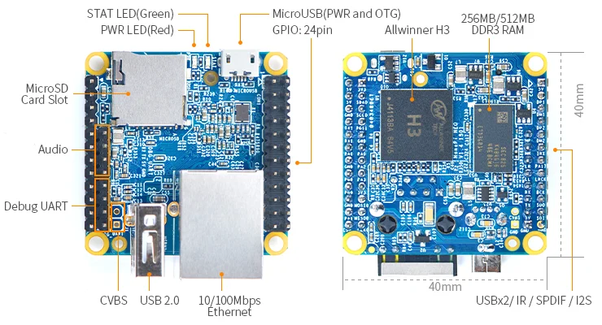
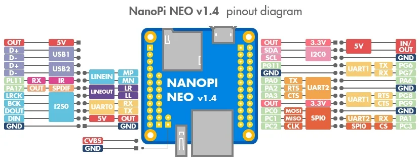

# NanoPi NEO

**FriendlyELEC** · H3

Revision: Multiple source revisions; match each reference filename

Coverage: Physical pinout source collected; check exact connector scope and revision

[Browse all manufacturers](../../../../BROWSE.md) · [Devices & IoT](../../../../DEVICES.md) · [Open in the browser guide](https://valleytech-black-wire-guide.pages.dev/?board=friendlyelec-nanopi-neo)

Architecture: **ARM**

## Datasheets and original documentation

Board datasheet: **not yet recorded**. Visual reference: **available**.

[Original manufacturer hardware website](https://wiki.friendlyelec.com/wiki/index.php/NanoPi_NEO)

- **hardware-guide / board**: [Manufacturer hardware manual and specifications](https://wiki.friendlyelec.com/wiki/index.php/NanoPi_NEO) · online
- **schematic / board**: [Schematic_NanoPi-NEO-V1.4-1801-20180320.pdf](https://wiki.friendlyelec.com/wiki/images/f/fd/Schematic_NanoPi-NEO-V1.4-1801-20180320.pdf) · online
- **schematic / board**: [NanoPi-NEO-1606-Schematic.pdf](https://wiki.friendlyelec.com/wiki/images/a/aa/NanoPi-NEO-1606-Schematic.pdf) · online
- **schematic / board**: [NanoPi-NEO-V1.1-1607-Schematic.pdf](https://wiki.friendlyelec.com/wiki/images/c/c4/NanoPi-NEO-V1.1-1607-Schematic.pdf) · online
- **schematic / board**: [NanoPi-NEO-V1.2-1608-Schematic.pdf](https://wiki.friendlyelec.com/wiki/images/1/1c/NanoPi-NEO-V1.2-1608-Schematic.pdf) · online
- **schematic / board**: [NanoPi-NEO-v1.3_1702.pdf](https://wiki.friendlyelec.com/wiki/images/5/51/NanoPi-NEO-v1.3_1702.pdf) · online
- **schematic / board**: [NanoPi-NEO-V1.31-1703-Schematic.pdf](https://wiki.friendlyelec.com/wiki/images/e/ec/NanoPi-NEO-V1.31-1703-Schematic.pdf) · online

Match the exact board, carrier and PCB revision. A component datasheet does not define the board header or input-power limits.

[Documentation coverage and remaining gaps](../../../../DOCUMENTATION.md)

## Specifications and hardware documentation

- [Manufacturer specifications & hardware guide](https://wiki.friendlyelec.com/wiki/index.php/NanoPi_NEO)

## NanoPi-NEO-layout.jpg

**board labeling image** · Reviewed source · JPG

[Open original reference](../../../../library/media/2f7285152c0d8633ab4650c9b2a4eab973ae745f8b77f9642cec8b452fae67b4.jpg)

**Credit and rights:** FriendlyELEC / original reference contributors. Asset-specific redistribution and print rights have not been established. Original artwork is not relicensed by the Black Wire editorial license.. Source/manufacturer: FriendlyELEC.

[Source 1](https://wiki.friendlyelec.com/wiki/images/3/35/NanoPi-NEO-layout.jpg) · [Source 2](https://wiki.friendlyelec.com/wiki/index.php/NanoPi_NEO)

Labeled board and connector locations. This is not a per-pin signal map.

Image revision: NanoPi-NEO-layout.jpg

SHA-256: `2f7285152c0d8633ab4650c9b2a4eab973ae745f8b77f9642cec8b452fae67b4`

## NEO_pinout-02.jpg

**pinout image** · Reviewed source · JPG

[Open original reference](../../../../library/media/c69acd469d1fb0ae2eef3cd449c2a6c2b1652207f12acedfa96e7d92d23f0ba2.jpg)

**Credit and rights:** FriendlyELEC / original reference contributors. Asset-specific redistribution and print rights have not been established. Original artwork is not relicensed by the Black Wire editorial license.. Source/manufacturer: FriendlyELEC.

[Source 1](https://wiki.friendlyelec.com/wiki/images/c/c4/NEO_pinout-02.jpg) · [Source 2](https://wiki.friendlyelec.com/wiki/index.php/NanoPi_NEO)

Physical connector map from the manufacturer. Verify PCB revision and each connector scope before wiring.

Image revision: v1.4

SHA-256: `c69acd469d1fb0ae2eef3cd449c2a6c2b1652207f12acedfa96e7d92d23f0ba2`

Pin assignments have not been independently electrically verified. Check board revision before wiring.
