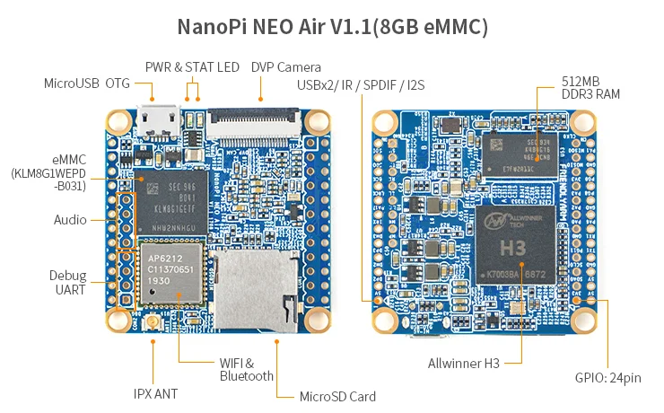
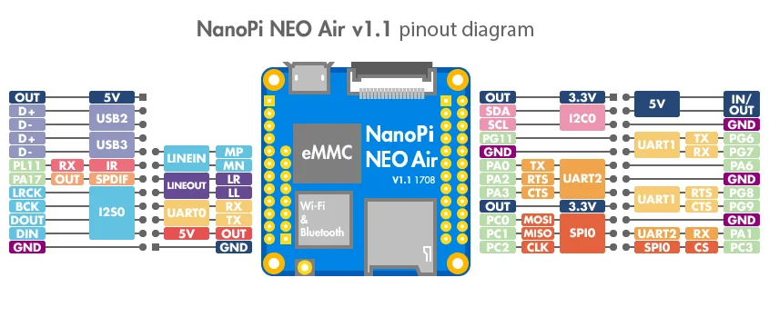

# NanoPi NEO Air

**FriendlyELEC** · H3

Revision: Multiple source revisions; match each reference filename

Coverage: Physical pinout source collected; check exact connector scope and revision

[Browse all manufacturers](../../../../BROWSE.md) · [Devices & IoT](../../../../DEVICES.md) · [Open in the browser guide](https://valleytech-black-wire-guide.pages.dev/?board=friendlyelec-nanopi-neo-air)

Architecture: **ARM**

## Datasheets and original documentation

Board datasheet: **not yet recorded**. Visual reference: **available**.

[Original manufacturer hardware website](https://wiki.friendlyelec.com/wiki/index.php/NanoPi_NEO_Air)

- **hardware-guide / board**: [Manufacturer hardware manual and specifications](https://wiki.friendlyelec.com/wiki/index.php/NanoPi_NEO_Air) · online
- **schematic / board**: [Schematic_NanoPi-NEO-Air-V1.1_1708.pdf](https://wiki.friendlyelec.com/wiki/images/7/70/Schematic_NanoPi-NEO-Air-V1.1_1708.pdf) · online
- **schematic / board**: [NanoPi-NEO-Air-1608-Schematic.pdf](https://wiki.friendlyelec.com/wiki/images/9/98/NanoPi-NEO-Air-1608-Schematic.pdf) · online

Match the exact board, carrier and PCB revision. A component datasheet does not define the board header or input-power limits.

[Documentation coverage and remaining gaps](../../../../DOCUMENTATION.md)

## Specifications and hardware documentation

- [Manufacturer specifications & hardware guide](https://wiki.friendlyelec.com/wiki/index.php/NanoPi_NEO_Air)

## NanoPi-NEO-AIR-layout.jpg

**board labeling image** · Reviewed source · JPG

[Open original reference](../../../../library/media/ee99d24848ddc9bda5a57f588a03a22928398963322b94fa0476b1bf35dde9cc.jpg)

**Credit and rights:** FriendlyELEC / original reference contributors. Asset-specific redistribution and print rights have not been established. Original artwork is not relicensed by the Black Wire editorial license.. Source/manufacturer: FriendlyELEC.

[Source 1](https://wiki.friendlyelec.com/wiki/images/0/0a/NanoPi-NEO-AIR-layout.jpg) · [Source 2](https://wiki.friendlyelec.com/wiki/index.php/NanoPi_NEO_Air)

Labeled board and connector locations. This is not a per-pin signal map.

Image revision: NanoPi-NEO-AIR-layout.jpg

SHA-256: `ee99d24848ddc9bda5a57f588a03a22928398963322b94fa0476b1bf35dde9cc`

## NanoPi-NEO-AIR_pinout-02.jpg

**pinout image** · Reviewed source · JPG

[Open original reference](../../../../library/media/9fd94c04567b4f19f5869115d179d971b33c5088c2c303af32a2e49dc2833b7d.jpg)

**Credit and rights:** FriendlyELEC / original reference contributors. Asset-specific redistribution and print rights have not been established. Original artwork is not relicensed by the Black Wire editorial license.. Source/manufacturer: FriendlyELEC.

[Source 1](https://wiki.friendlyelec.com/wiki/images/e/e3/NanoPi-NEO-AIR_pinout-02.jpg) · [Source 2](https://wiki.friendlyelec.com/wiki/index.php/NanoPi_NEO_Air)

Physical connector map from the manufacturer. Verify PCB revision and each connector scope before wiring.

Image revision: v1.1

SHA-256: `9fd94c04567b4f19f5869115d179d971b33c5088c2c303af32a2e49dc2833b7d`

Pin assignments have not been independently electrically verified. Check board revision before wiring.
