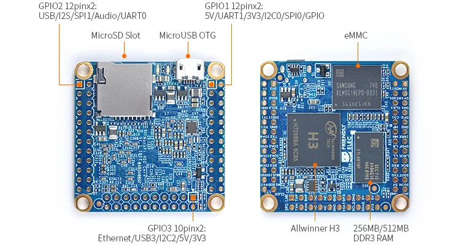
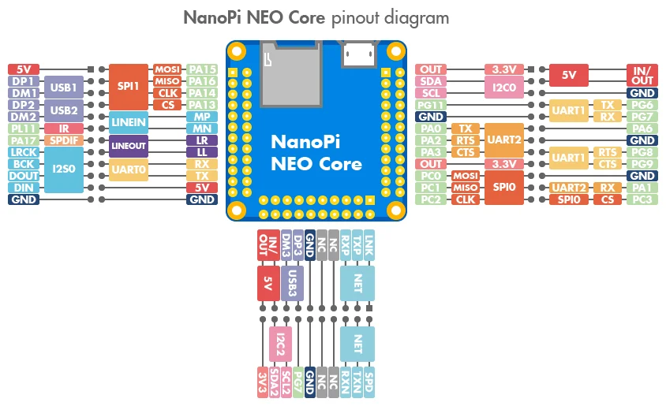

# NanoPi NEO Core

**FriendlyELEC** · H3

Revision: Multiple source revisions; match each reference filename

Coverage: Physical pinout source collected; check exact connector scope and revision

[Browse all manufacturers](../../../../BROWSE.md) · [Devices & IoT](../../../../DEVICES.md) · [Open in the browser guide](https://valleytech-black-wire-guide.pages.dev/?board=friendlyelec-nanopi-neo-core)

Architecture: **ARM**

## Datasheets and original documentation

Board datasheet: **not yet recorded**. Visual reference: **available**.

[Original manufacturer hardware website](https://wiki.friendlyelec.com/wiki/index.php/NanoPi_NEO_Core)

- **hardware-guide / board**: [Manufacturer hardware manual and specifications](https://wiki.friendlyelec.com/wiki/index.php/NanoPi_NEO_Core) · online
- **schematic / board**: [Nanopi_neo_core-v1.1-1802.pdf](https://wiki.friendlyelec.com/wiki/images/a/a4/Nanopi_neo_core-v1.1-1802.pdf) · online
- **schematic / board**: [NANOPI_NEO_CORE-V1.0.pdf](https://wiki.friendlyelec.com/wiki/images/7/7a/NANOPI_NEO_CORE-V1.0.pdf) · online

Match the exact board, carrier and PCB revision. A component datasheet does not define the board header or input-power limits.

[Documentation coverage and remaining gaps](../../../../DOCUMENTATION.md)

## Specifications and hardware documentation

- [Manufacturer specifications & hardware guide](https://wiki.friendlyelec.com/wiki/index.php/NanoPi_NEO_Core)

## NanoPi-NEO_Core-layout.jpg

**board labeling image** · Reviewed source · JPG

[Open original reference](../../../../library/media/0121c816519b15311140f3553f5c485074def15f8676030afe457ca12195c5ad.jpg)

**Credit and rights:** FriendlyELEC / original reference contributors. Asset-specific redistribution and print rights have not been established. Original artwork is not relicensed by the Black Wire editorial license.. Source/manufacturer: FriendlyELEC.

[Source 1](https://wiki.friendlyelec.com/wiki/images/2/25/NanoPi-NEO_Core-layout.jpg) · [Source 2](https://wiki.friendlyelec.com/wiki/index.php/NanoPi_NEO_Core)

Labeled board and connector locations. This is not a per-pin signal map.

Image revision: NanoPi-NEO_Core-layout.jpg

SHA-256: `0121c816519b15311140f3553f5c485074def15f8676030afe457ca12195c5ad`

## NEO_Core_pinout-02.jpg

**pinout image** · Reviewed source · JPG

[Open original reference](../../../../library/media/9490311db8f2473248b2dba16cb9bf6d8dabb77854b8fbb805e778858b576fa6.jpg)

**Credit and rights:** FriendlyELEC / original reference contributors. Asset-specific redistribution and print rights have not been established. Original artwork is not relicensed by the Black Wire editorial license.. Source/manufacturer: FriendlyELEC.

[Source 1](https://wiki.friendlyelec.com/wiki/images/5/53/NEO_Core_pinout-02.jpg) · [Source 2](https://wiki.friendlyelec.com/wiki/index.php/NanoPi_NEO_Core)

Physical connector map from the manufacturer. Verify PCB revision and each connector scope before wiring.

Image revision: NEO_Core_pinout-02.jpg

SHA-256: `9490311db8f2473248b2dba16cb9bf6d8dabb77854b8fbb805e778858b576fa6`

Pin assignments have not been independently electrically verified. Check board revision before wiring.
