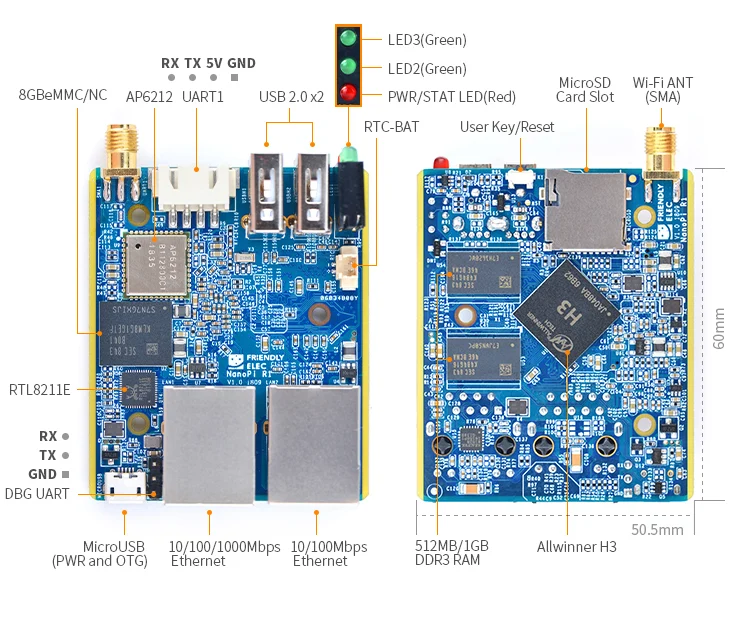

# NanoPi R1

**FriendlyELEC** · H3

Revision: Multiple source revisions; match each reference filename

Coverage: Supporting references collected; physical GPIO map still needed

[Browse all manufacturers](../../../../BROWSE.md) · [Devices & IoT](../../../../DEVICES.md) · [Open in the browser guide](https://valleytech-black-wire-guide.pages.dev/?board=friendlyelec-nanopi-r1)

Architecture: **ARM**

## Datasheets and original documentation

Board datasheet: **not yet recorded**. Visual reference: **available**.

[Original manufacturer hardware website](https://wiki.friendlyelec.com/wiki/index.php/NanoPi_R1)

- **hardware-guide / board**: [Manufacturer hardware manual and specifications](https://wiki.friendlyelec.com/wiki/index.php/NanoPi_R1) · online
- **schematic / board**: [NanoPi_R1_V1.0_1809-Schematic.pdf](https://wiki.friendlyelec.com/wiki/images/a/ab/NanoPi_R1_V1.0_1809-Schematic.pdf) · online

Match the exact board, carrier and PCB revision. A component datasheet does not define the board header or input-power limits.

[Documentation coverage and remaining gaps](../../../../DOCUMENTATION.md)

## Specifications and hardware documentation

- [Manufacturer specifications & hardware guide](https://wiki.friendlyelec.com/wiki/index.php/NanoPi_R1)

## NanoPi_R1-layout.jpg

**board labeling image** · Reviewed source · JPG

[Open original reference](../../../../library/media/ce67305c382afc8bbd456f2521712ef472c2e0cf41410d21f20e4d09b92aeb87.jpg)

**Credit and rights:** FriendlyELEC / original reference contributors. Asset-specific redistribution and print rights have not been established. Original artwork is not relicensed by the Black Wire editorial license.. Source/manufacturer: FriendlyELEC.

[Source 1](https://wiki.friendlyelec.com/wiki/images/4/43/NanoPi_R1-layout.jpg) · [Source 2](https://wiki.friendlyelec.com/wiki/index.php/NanoPi_R1)

Labeled board and connector locations. This is not a per-pin signal map.

Image revision: NanoPi_R1-layout.jpg

SHA-256: `ce67305c382afc8bbd456f2521712ef472c2e0cf41410d21f20e4d09b92aeb87`

Pin assignments have not been independently electrically verified. Check board revision before wiring.
