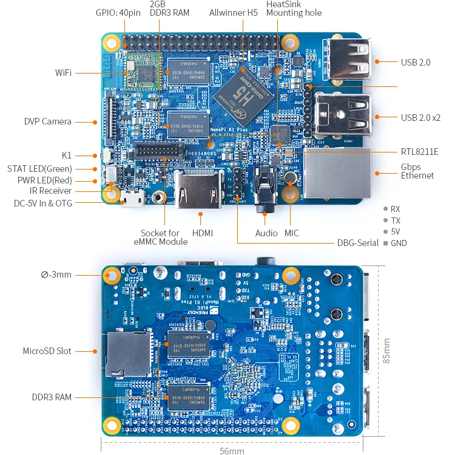

# NanoPi K1 Plus

**FriendlyELEC** · H5

Revision: Multiple source revisions; match each reference filename

Coverage: Supporting references collected; physical GPIO map still needed

[Browse all manufacturers](../../../../BROWSE.md) · [Devices & IoT](../../../../DEVICES.md) · [Open in the browser guide](https://valleytech-black-wire-guide.pages.dev/?board=friendlyelec-nanopi-k1-plus)

Architecture: **ARM**

## Datasheets and original documentation

Board datasheet: **not yet recorded**. Visual reference: **available**.

[Original manufacturer hardware website](https://wiki.friendlyelec.com/wiki/index.php/NanoPi_K1_Plus)

- **hardware-guide / board**: [Manufacturer hardware manual and specifications](https://wiki.friendlyelec.com/wiki/index.php/NanoPi_K1_Plus) · online
- **schematic / board**: [Schematic_NanoPi-K1_Plus-1712_20171214.pdf](https://wiki.friendlyelec.com/wiki/images/f/f3/Schematic_NanoPi-K1_Plus-1712_20171214.pdf) · online

Match the exact board, carrier and PCB revision. A component datasheet does not define the board header or input-power limits.

[Documentation coverage and remaining gaps](../../../../DOCUMENTATION.md)

## Specifications and hardware documentation

- [Manufacturer specifications & hardware guide](https://wiki.friendlyelec.com/wiki/index.php/NanoPi_K1_Plus)

## NanoPi-K1-Plus-001.png

**board labeling image** · Reviewed source · PNG

[Open original reference](../../../../library/media/46fedb319b1367f6b22aa771ef69113e0d6c60dc7a229819d17167b369219d98.png)

**Credit and rights:** FriendlyELEC / original reference contributors. Asset-specific redistribution and print rights have not been established. Original artwork is not relicensed by the Black Wire editorial license.. Source/manufacturer: FriendlyELEC.

[Source 1](https://wiki.friendlyelec.com/wiki/images/8/8e/NanoPi-K1-Plus-001.png) · [Source 2](https://wiki.friendlyelec.com/wiki/index.php/NanoPi_K1_Plus)

Labeled board and connector locations. This is not a per-pin signal map.

Image revision: NanoPi-K1-Plus-001.png

SHA-256: `46fedb319b1367f6b22aa771ef69113e0d6c60dc7a229819d17167b369219d98`

Pin assignments have not been independently electrically verified. Check board revision before wiring.
