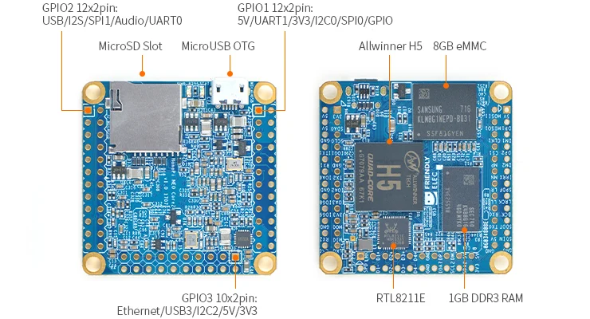
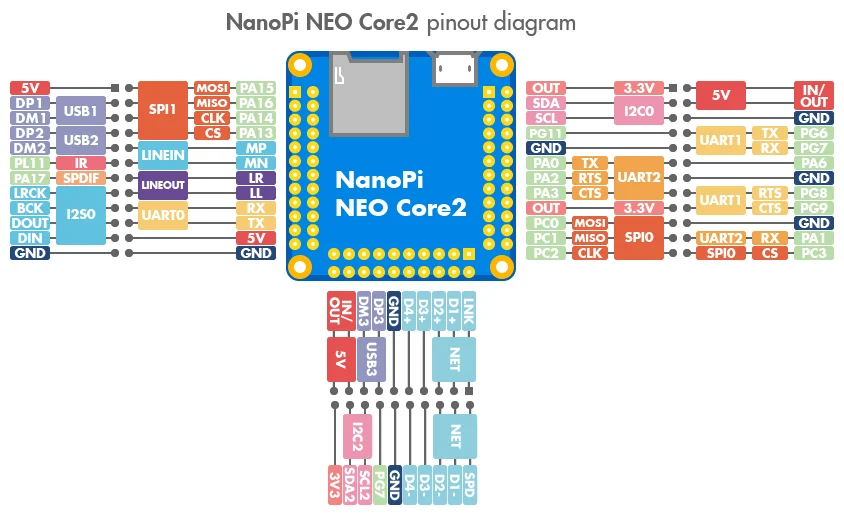

# NanoPi NEO Core2

**FriendlyELEC** · H5

Revision: Multiple source revisions; match each reference filename

Coverage: Physical pinout source collected; check exact connector scope and revision

[Browse all manufacturers](../../../../BROWSE.md) · [Devices & IoT](../../../../DEVICES.md) · [Open in the browser guide](https://valleytech-black-wire-guide.pages.dev/?board=friendlyelec-nanopi-neo-core2)

Architecture: **ARM**

## Datasheets and original documentation

Board datasheet: **not yet recorded**. Visual reference: **available**.

[Original manufacturer hardware website](https://wiki.friendlyelec.com/wiki/index.php/NanoPi_NEO_Core2)

- **hardware-guide / board**: [Manufacturer hardware manual and specifications](https://wiki.friendlyelec.com/wiki/index.php/NanoPi_NEO_Core2) · online
- **schematic / board**: [NanoPi_NEO_Core2-V1.0_1707.pdf](https://wiki.friendlyelec.com/wiki/images/6/6b/NanoPi_NEO_Core2-V1.0_1707.pdf) · online

Match the exact board, carrier and PCB revision. A component datasheet does not define the board header or input-power limits.

[Documentation coverage and remaining gaps](../../../../DOCUMENTATION.md)

## Specifications and hardware documentation

- [Manufacturer specifications & hardware guide](https://wiki.friendlyelec.com/wiki/index.php/NanoPi_NEO_Core2)

## NanoPi-NEO_Core2-layout.jpg

**board labeling image** · Reviewed source · JPG

[Open original reference](../../../../library/media/fd3d8e7a54d2e8881ddd3ce9f3229c469ea8c320447a6dd2bc28e9bab0db2161.jpg)

**Credit and rights:** FriendlyELEC / original reference contributors. Asset-specific redistribution and print rights have not been established. Original artwork is not relicensed by the Black Wire editorial license.. Source/manufacturer: FriendlyELEC.

[Source 1](https://wiki.friendlyelec.com/wiki/images/2/2d/NanoPi-NEO_Core2-layout.jpg) · [Source 2](https://wiki.friendlyelec.com/wiki/index.php/NanoPi_NEO_Core2)

Labeled board and connector locations. This is not a per-pin signal map.

Image revision: NanoPi-NEO_Core2-layout.jpg

SHA-256: `fd3d8e7a54d2e8881ddd3ce9f3229c469ea8c320447a6dd2bc28e9bab0db2161`

## NEO_Core2_pinout-02.jpg

**pinout image** · Reviewed source · JPG

[Open original reference](../../../../library/media/dac17a9fb3b28063485164623f54111f9cdfd990ae84e32b1a0f548b58132145.jpg)

**Credit and rights:** FriendlyELEC / original reference contributors. Asset-specific redistribution and print rights have not been established. Original artwork is not relicensed by the Black Wire editorial license.. Source/manufacturer: FriendlyELEC.

[Source 1](https://wiki.friendlyelec.com/wiki/images/e/e2/NEO_Core2_pinout-02.jpg) · [Source 2](https://wiki.friendlyelec.com/wiki/index.php/NanoPi_NEO_Core2)

Physical connector map from the manufacturer. Verify PCB revision and each connector scope before wiring.

Image revision: NEO_Core2_pinout-02.jpg

SHA-256: `dac17a9fb3b28063485164623f54111f9cdfd990ae84e32b1a0f548b58132145`

Pin assignments have not been independently electrically verified. Check board revision before wiring.
