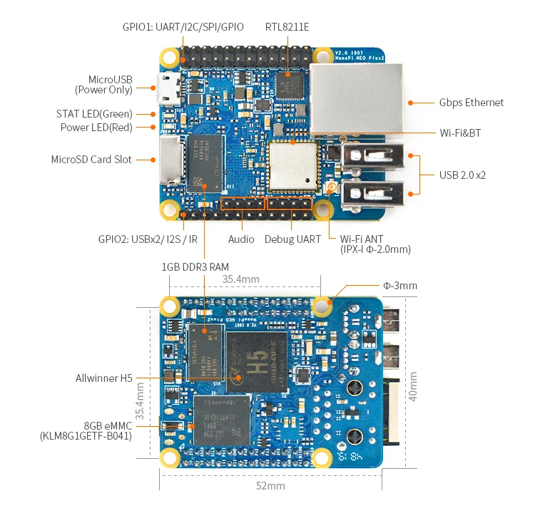
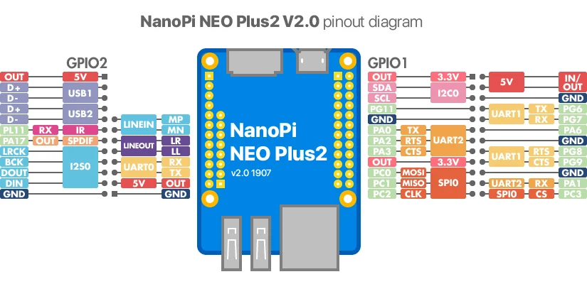

# NanoPi NEO Plus2

**FriendlyELEC** · H5

Revision: Multiple source revisions; match each reference filename

Coverage: Physical pinout source collected; check exact connector scope and revision

[Browse all manufacturers](../../../../BROWSE.md) · [Devices & IoT](../../../../DEVICES.md) · [Open in the browser guide](https://valleytech-black-wire-guide.pages.dev/?board=friendlyelec-nanopi-neo-plus2)

Architecture: **ARM**

## Datasheets and original documentation

Board datasheet: **not yet recorded**. Visual reference: **available**.

[Original manufacturer hardware website](https://wiki.friendlyelec.com/wiki/index.php/NanoPi_NEO_Plus2)

- **hardware-guide / board**: [Manufacturer hardware manual and specifications](https://wiki.friendlyelec.com/wiki/index.php/NanoPi_NEO_Plus2) · online
- **schematic / board**: [NanoPi_NEO_Plus2-20190328.pdf](https://wiki.friendlyelec.com/wiki/images/4/48/NanoPi_NEO_Plus2-20190328.pdf) · online
- **schematic / board**: [Schematic_NanoPi_NEO_Plus2_V2_1907.pdf](https://wiki.friendlyelec.com/wiki/images/3/38/Schematic_NanoPi_NEO_Plus2_V2_1907.pdf) · online
- **schematic / board**: [Schematic_NanoPi_NEO_Plus2-v1.1-1805.pdf](https://wiki.friendlyelec.com/wiki/images/b/bf/Schematic_NanoPi_NEO_Plus2-v1.1-1805.pdf) · online
- **schematic / board**: [Schematic_NanoPi_NEO_Plus2-v1.0-1704.pdf](https://wiki.friendlyelec.com/wiki/images/8/86/Schematic_NanoPi_NEO_Plus2-v1.0-1704.pdf) · online

Match the exact board, carrier and PCB revision. A component datasheet does not define the board header or input-power limits.

[Documentation coverage and remaining gaps](../../../../DOCUMENTATION.md)

## Specifications and hardware documentation

- [Manufacturer specifications & hardware guide](https://wiki.friendlyelec.com/wiki/index.php/NanoPi_NEO_Plus2)

## NanoPi-NEO-Plus2-layout.jpg

**board labeling image** · Reviewed source · JPG

[Open original reference](../../../../library/media/d11c1999e0f425057b7af905844d96a7421df29e81d3891718f0e19489b7e2b6.jpg)

**Credit and rights:** FriendlyELEC / original reference contributors. Asset-specific redistribution and print rights have not been established. Original artwork is not relicensed by the Black Wire editorial license.. Source/manufacturer: FriendlyELEC.

[Source 1](https://wiki.friendlyelec.com/wiki/images/a/a5/NanoPi-NEO-Plus2-layout.jpg) · [Source 2](https://wiki.friendlyelec.com/wiki/index.php/NanoPi_NEO_Plus2)

Labeled board and connector locations. This is not a per-pin signal map.

Image revision: NanoPi-NEO-Plus2-layout.jpg

SHA-256: `d11c1999e0f425057b7af905844d96a7421df29e81d3891718f0e19489b7e2b6`

## NanoPi-NEO-Plus2_pinout-02.jpg

**pinout image** · Reviewed source · JPG

[Open original reference](../../../../library/media/e36b50da8db622e62ba8bb3549f95afe94d830477f973a0eb35b1406dacedf46.jpg)

**Credit and rights:** FriendlyELEC / original reference contributors. Asset-specific redistribution and print rights have not been established. Original artwork is not relicensed by the Black Wire editorial license.. Source/manufacturer: FriendlyELEC.

[Source 1](https://wiki.friendlyelec.com/wiki/images/9/9e/NanoPi-NEO-Plus2_pinout-02.jpg) · [Source 2](https://wiki.friendlyelec.com/wiki/index.php/NanoPi_NEO_Plus2)

Physical connector map from the manufacturer. Verify PCB revision and each connector scope before wiring.

Image revision: v2.0

SHA-256: `e36b50da8db622e62ba8bb3549f95afe94d830477f973a0eb35b1406dacedf46`

Pin assignments have not been independently electrically verified. Check board revision before wiring.
