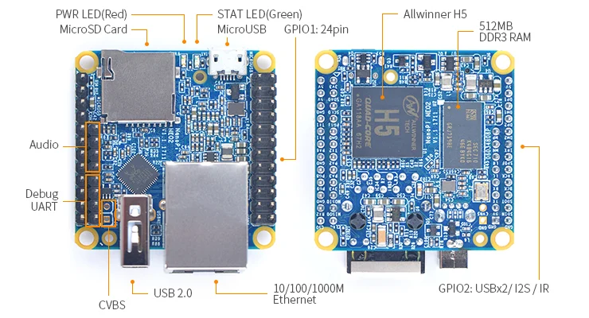
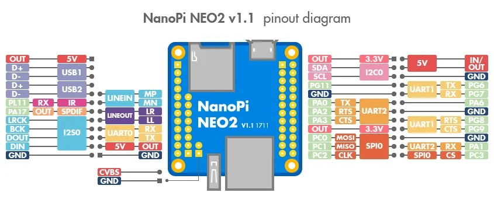

# NanoPi NEO2

**FriendlyELEC** · H5

Revision: Multiple source revisions; match each reference filename

Coverage: Physical pinout source collected; check exact connector scope and revision

[Browse all manufacturers](../../../../BROWSE.md) · [Devices & IoT](../../../../DEVICES.md) · [Open in the browser guide](https://valleytech-black-wire-guide.pages.dev/?board=friendlyelec-nanopi-neo2)

Architecture: **ARM**

## Datasheets and original documentation

Board datasheet: **not yet recorded**. Visual reference: **available**.

[Original manufacturer hardware website](https://wiki.friendlyelec.com/wiki/index.php/NanoPi_NEO2)

- **hardware-guide / board**: [Manufacturer hardware manual and specifications](https://wiki.friendlyelec.com/wiki/index.php/NanoPi_NEO2) · online
- **schematic / board**: [Schematic_NanoPi_NEO2-V1.1-1711.pdf](https://wiki.friendlyelec.com/wiki/images/d/db/Schematic_NanoPi_NEO2-V1.1-1711.pdf) · online
- **schematic / board**: [Schematic_NanoPi_NEO2-v1.0_1701.pdf](https://wiki.friendlyelec.com/wiki/images/a/a1/Schematic_NanoPi_NEO2-v1.0_1701.pdf) · online

Match the exact board, carrier and PCB revision. A component datasheet does not define the board header or input-power limits.

[Documentation coverage and remaining gaps](../../../../DOCUMENTATION.md)

## Specifications and hardware documentation

- [Manufacturer specifications & hardware guide](https://wiki.friendlyelec.com/wiki/index.php/NanoPi_NEO2)

## NanoPi-NEO2-layout.jpg

**board labeling image** · Reviewed source · JPG

[Open original reference](../../../../library/media/8b94f188c95f40eefe83430f18827315e011777c6b15c2bde7bb43114cf0aa03.jpg)

**Credit and rights:** FriendlyELEC / original reference contributors. Asset-specific redistribution and print rights have not been established. Original artwork is not relicensed by the Black Wire editorial license.. Source/manufacturer: FriendlyELEC.

[Source 1](https://wiki.friendlyelec.com/wiki/images/2/25/NanoPi-NEO2-layout.jpg) · [Source 2](https://wiki.friendlyelec.com/wiki/index.php/NanoPi_NEO2)

Labeled board and connector locations. This is not a per-pin signal map.

Image revision: NanoPi-NEO2-layout.jpg

SHA-256: `8b94f188c95f40eefe83430f18827315e011777c6b15c2bde7bb43114cf0aa03`

## NEO2_pinout-02.jpg

**pinout image** · Reviewed source · JPG

[Open original reference](../../../../library/media/fa8aeef8d0332b22b0c4cf2ac4aaf291f31b2c16f5d8494521483470356ac4fc.jpg)

**Credit and rights:** FriendlyELEC / original reference contributors. Asset-specific redistribution and print rights have not been established. Original artwork is not relicensed by the Black Wire editorial license.. Source/manufacturer: FriendlyELEC.

[Source 1](https://wiki.friendlyelec.com/wiki/images/2/27/NEO2_pinout-02.jpg) · [Source 2](https://wiki.friendlyelec.com/wiki/index.php/NanoPi_NEO2)

Physical connector map from the manufacturer. Verify PCB revision and each connector scope before wiring.

Image revision: v1.1

SHA-256: `fa8aeef8d0332b22b0c4cf2ac4aaf291f31b2c16f5d8494521483470356ac4fc`

Pin assignments have not been independently electrically verified. Check board revision before wiring.
