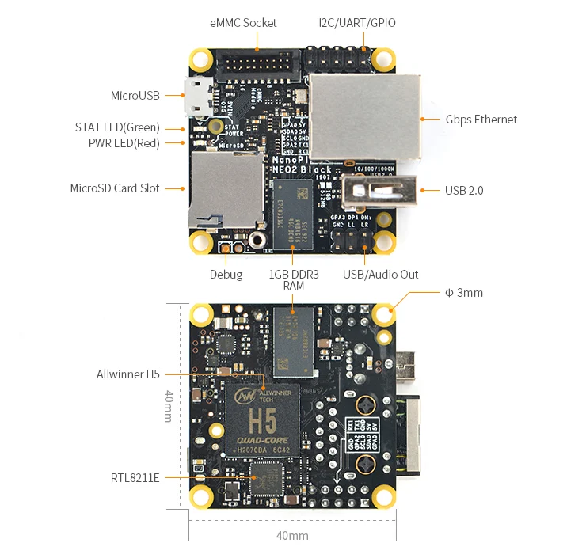

# NanoPi NEO2 Black

**FriendlyELEC** · H5

Revision: Multiple source revisions; match each reference filename

Coverage: Supporting references collected; physical GPIO map still needed

[Browse all manufacturers](../../../../BROWSE.md) · [Devices & IoT](../../../../DEVICES.md) · [Open in the browser guide](https://valleytech-black-wire-guide.pages.dev/?board=friendlyelec-nanopi-neo2-black)

Architecture: **ARM**

## Datasheets and original documentation

Board datasheet: **not yet recorded**. Visual reference: **available**.

[Original manufacturer hardware website](https://wiki.friendlyelec.com/wiki/index.php/NanoPi_NEO2_Black)

- **hardware-guide / board**: [Manufacturer hardware manual and specifications](https://wiki.friendlyelec.com/wiki/index.php/NanoPi_NEO2_Black) · online
- **schematic / board**: [NanoPi-NEO2-Black_1907_Schematic.pdf](https://wiki.friendlyelec.com/wiki/images/5/57/NanoPi-NEO2-Black_1907_Schematic.pdf) · online

Match the exact board, carrier and PCB revision. A component datasheet does not define the board header or input-power limits.

[Documentation coverage and remaining gaps](../../../../DOCUMENTATION.md)

## Specifications and hardware documentation

- [Manufacturer specifications & hardware guide](https://wiki.friendlyelec.com/wiki/index.php/NanoPi_NEO2_Black)

## NanoPi_NEO2_Black-layout.jpg

**board labeling image** · Reviewed source · JPG

[Open original reference](../../../../library/media/413b01adbea1fe0d3ca98cc5cf6c74cdc96f76da5ecbf6e4c9c71e69a857dd99.jpg)

**Credit and rights:** FriendlyELEC / original reference contributors. Asset-specific redistribution and print rights have not been established. Original artwork is not relicensed by the Black Wire editorial license.. Source/manufacturer: FriendlyELEC.

[Source 1](https://wiki.friendlyelec.com/wiki/images/9/9c/NanoPi_NEO2_Black-layout.jpg) · [Source 2](https://wiki.friendlyelec.com/wiki/index.php/NanoPi_NEO2_Black)

Labeled board and connector locations. This is not a per-pin signal map.

Image revision: NanoPi_NEO2_Black-layout.jpg

SHA-256: `413b01adbea1fe0d3ca98cc5cf6c74cdc96f76da5ecbf6e4c9c71e69a857dd99`

Pin assignments have not been independently electrically verified. Check board revision before wiring.
