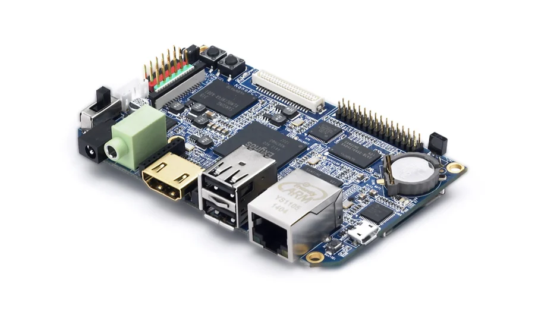
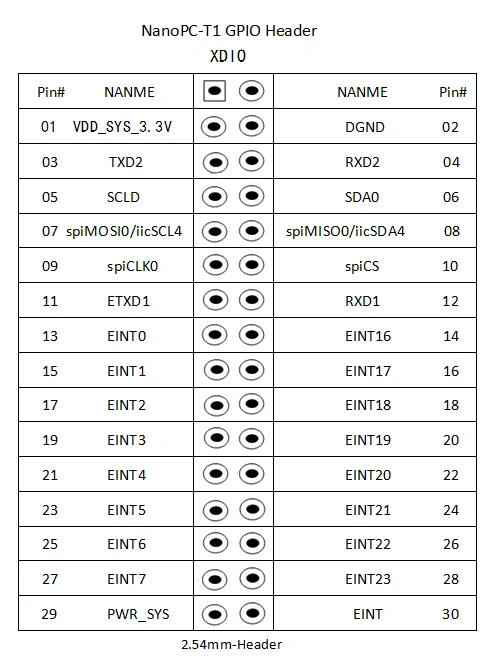

# NanoPC-T1

**FriendlyELEC** · Exynos 4412

Revision: Multiple source revisions; match each reference filename

Coverage: Physical pinout source collected; check exact connector scope and revision

[Browse all manufacturers](../../../../BROWSE.md) · [Devices & IoT](../../../../DEVICES.md) · [Open in the browser guide](https://valleytech-black-wire-guide.pages.dev/?board=friendlyelec-nanopc-t1)

Architecture: **ARM**

## Datasheets and original documentation

Board datasheet: **not yet recorded**. Visual reference: **available**.

[Original manufacturer hardware website](https://wiki.friendlyelec.com/wiki/index.php/NanoPC-T1)

- **hardware-guide / board**: [Manufacturer hardware manual and specifications](https://wiki.friendlyelec.com/wiki/index.php/NanoPC-T1) · online

Match the exact board, carrier and PCB revision. A component datasheet does not define the board header or input-power limits.

[Documentation coverage and remaining gaps](../../../../DOCUMENTATION.md)

## Specifications and hardware documentation

- [Manufacturer specifications & hardware guide](https://wiki.friendlyelec.com/wiki/index.php/NanoPC-T1)

## NanoPC-T1.png

**product photograph** · Reviewed source · PNG

[Open original reference](../../../../library/media/20fb0ca2810e25b30d634628f5708f1cc8e3e7c011e12125e6cef1bb798a8fa7.png)

**Credit and rights:** FriendlyELEC / original reference contributors. Asset-specific redistribution and print rights have not been established. Original artwork is not relicensed by the Black Wire editorial license.. Source/manufacturer: FriendlyELEC.

[Source 1](https://wiki.friendlyelec.com/wiki/images/8/86/NanoPC-T1.png) · [Source 2](https://wiki.friendlyelec.com/wiki/index.php/NanoPC-T1)

Product photograph only; pin assignments must be read in the manufacturer documentation.

Image revision: NanoPC-T1.png

SHA-256: `20fb0ca2810e25b30d634628f5708f1cc8e3e7c011e12125e6cef1bb798a8fa7`

## NanoPC-T102.png

**pinout image** · Reviewed source · PNG

[Open original reference](../../../../library/media/0a03cb1600d1fd8b38a643d941af50a5120b6332493ff3c74d1edd9636964867.png)

**Credit and rights:** FriendlyELEC / original reference contributors. Asset-specific redistribution and print rights have not been established. Original artwork is not relicensed by the Black Wire editorial license.. Source/manufacturer: FriendlyELEC.

[Source 1](https://wiki.friendlyelec.com/wiki/images/8/8f/NanoPC-T102.png) · [Source 2](https://wiki.friendlyelec.com/wiki/index.php/NanoPC-T1)

Physical connector map from the manufacturer. Verify PCB revision and each connector scope before wiring.

Image revision: NanoPC-T102.png

SHA-256: `0a03cb1600d1fd8b38a643d941af50a5120b6332493ff3c74d1edd9636964867`

Pin assignments have not been independently electrically verified. Check board revision before wiring.
