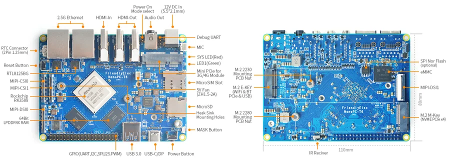

# NanoPC-T6

**FriendlyELEC** · RK3588

Revision: Multiple source revisions; match each reference filename

Coverage: Supporting references collected; physical GPIO map still needed

[Browse all manufacturers](../../../../BROWSE.md) · [Devices & IoT](../../../../DEVICES.md) · [Open in the browser guide](https://valleytech-black-wire-guide.pages.dev/?board=friendlyelec-nanopc-t6)

Architecture: **ARM**

## Datasheets and original documentation

Board datasheet: **not yet recorded**. Visual reference: **available**.

[Original manufacturer hardware website](https://wiki.friendlyelec.com/wiki/index.php/NanoPC-T6)

- **hardware-guide / board**: [Manufacturer hardware manual and specifications](https://wiki.friendlyelec.com/wiki/index.php/NanoPC-T6) · online
- **schematic / board**: [NanoPC-T6_2301_SCH.PDF](https://wiki.friendlyelec.com/wiki/images/9/97/NanoPC-T6_2301_SCH.PDF) · online

Match the exact board, carrier and PCB revision. A component datasheet does not define the board header or input-power limits.

[Documentation coverage and remaining gaps](../../../../DOCUMENTATION.md)

## Specifications and hardware documentation

- [Manufacturer specifications & hardware guide](https://wiki.friendlyelec.com/wiki/index.php/NanoPC-T6)

## NanoPC-T6_Layout-L.jpg

**board labeling image** · Reviewed source · JPG

[Open original reference](../../../../library/media/f2825f012b2d441c03b68d79b48b34898f0e2aca0ed1e0f45513a9bd5d85429a.jpg)

**Credit and rights:** FriendlyELEC / original reference contributors. Asset-specific redistribution and print rights have not been established. Original artwork is not relicensed by the Black Wire editorial license.. Source/manufacturer: FriendlyELEC.

[Source 1](https://wiki.friendlyelec.com/wiki/images/0/0b/NanoPC-T6_Layout-L.jpg) · [Source 2](https://wiki.friendlyelec.com/wiki/index.php/NanoPC-T6)

Labeled board and connector locations. This is not a per-pin signal map.

Image revision: NanoPC-T6_Layout-L.jpg

SHA-256: `f2825f012b2d441c03b68d79b48b34898f0e2aca0ed1e0f45513a9bd5d85429a`

Pin assignments have not been independently electrically verified. Check board revision before wiring.
