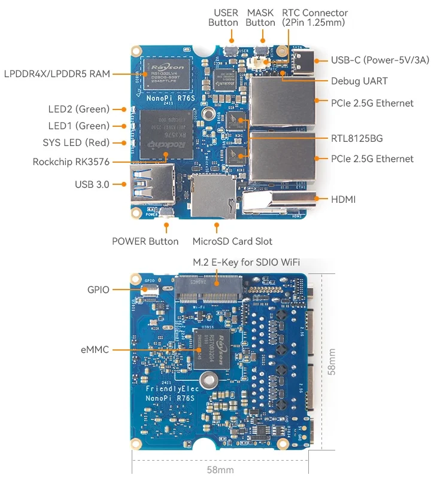
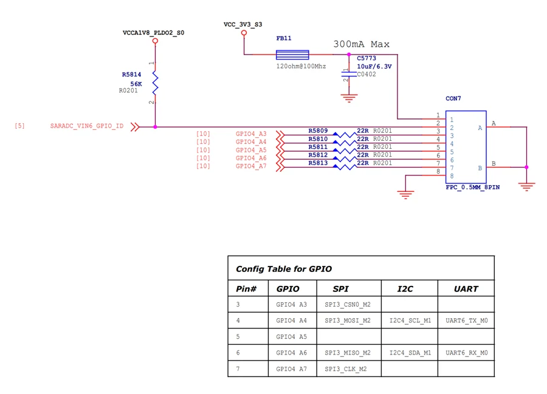

# NanoPi R76S

**FriendlyELEC** · RK3576

Revision: Multiple source revisions; match each reference filename

Coverage: Supporting references collected; physical GPIO map still needed

[Browse all manufacturers](../../../../BROWSE.md) · [Devices & IoT](../../../../DEVICES.md) · [Open in the browser guide](https://valleytech-black-wire-guide.pages.dev/?board=friendlyelec-nanopi-r76s)

Architecture: **ARM**

## Datasheets and original documentation

Board datasheet: **not yet recorded**. Visual reference: **available**.

[Original manufacturer hardware website](https://wiki.friendlyelec.com/wiki/index.php/NanoPi_R76S)

- **hardware-guide / board**: [Manufacturer hardware manual and specifications](https://wiki.friendlyelec.com/wiki/index.php/NanoPi_R76S) · online
- **schematic / board**: [NanoPi_R76S_LP4X_2411_SCH.pdf](https://wiki.friendlyelec.com/wiki/images/6/60/NanoPi_R76S_LP4X_2411_SCH.pdf) · online
- **schematic / board**: [NanoPi_R76S_LP5_2411_SCH.pdf](https://wiki.friendlyelec.com/wiki/images/9/90/NanoPi_R76S_LP5_2411_SCH.pdf) · online

Match the exact board, carrier and PCB revision. A component datasheet does not define the board header or input-power limits.

[Documentation coverage and remaining gaps](../../../../DOCUMENTATION.md)

## Specifications and hardware documentation

- [Manufacturer specifications & hardware guide](https://wiki.friendlyelec.com/wiki/index.php/NanoPi_R76S)

## NanoPi_R76S_Layout.jpg

**board labeling image** · Reviewed source · JPG

[Open original reference](../../../../library/media/987c3d078ce6c0fbef6fa516ffb5eed8ef636b239f33e6a851ccf28b772ec93b.jpg)

**Credit and rights:** FriendlyELEC / original reference contributors. Asset-specific redistribution and print rights have not been established. Original artwork is not relicensed by the Black Wire editorial license.. Source/manufacturer: FriendlyELEC.

[Source 1](https://wiki.friendlyelec.com/wiki/images/8/8d/NanoPi_R76S_Layout.jpg) · [Source 2](https://wiki.friendlyelec.com/wiki/index.php/NanoPi_R76S)

Labeled board and connector locations. This is not a per-pin signal map.

Image revision: NanoPi_R76S_Layout.jpg

SHA-256: `987c3d078ce6c0fbef6fa516ffb5eed8ef636b239f33e6a851ccf28b772ec93b`

## NanoPi_R76S_Gpio.jpg

**pin function reference** · Reviewed source · JPG

[Open original reference](../../../../library/media/459ac8dbf5bd195fdf4db6629ee31c68db72cf73441a0cf4159d0f192cb65bd4.jpg)

**Credit and rights:** FriendlyELEC / original reference contributors. Asset-specific redistribution and print rights have not been established. Original artwork is not relicensed by the Black Wire editorial license.. Source/manufacturer: FriendlyELEC.

[Source 1](https://wiki.friendlyelec.com/wiki/images/0/0c/NanoPi_R76S_Gpio.jpg) · [Source 2](https://wiki.friendlyelec.com/wiki/index.php/NanoPi_R76S)

Schematic connector symbol and function table; this does not establish physical connector orientation.

Image revision: NanoPi_R76S_Gpio.jpg

SHA-256: `459ac8dbf5bd195fdf4db6629ee31c68db72cf73441a0cf4159d0f192cb65bd4`

Pin assignments have not been independently electrically verified. Check board revision before wiring.
