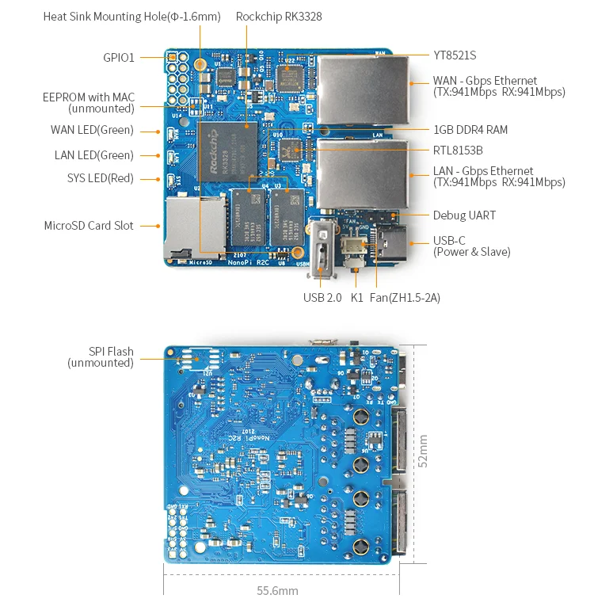

# NanoPi R2C

**FriendlyELEC** · RK3328

Revision: Multiple source revisions; match each reference filename

Coverage: Supporting references collected; physical GPIO map still needed

[Browse all manufacturers](../../../../BROWSE.md) · [Devices & IoT](../../../../DEVICES.md) · [Open in the browser guide](https://valleytech-black-wire-guide.pages.dev/?board=friendlyelec-nanopi-r2c)

Architecture: **ARM**

## Datasheets and original documentation

Board datasheet: **not yet recorded**. Visual reference: **available**.

[Original manufacturer hardware website](https://wiki.friendlyelec.com/wiki/index.php/NanoPi_R2C)

- **hardware-guide / board**: [Manufacturer hardware manual and specifications](https://wiki.friendlyelec.com/wiki/index.php/NanoPi_R2C) · online
- **schematic / board**: [NanoPi_R2C_2107_SCH.pdf](https://wiki.friendlyelec.com/wiki/images/b/b1/NanoPi_R2C_2107_SCH.pdf) · online

Match the exact board, carrier and PCB revision. A component datasheet does not define the board header or input-power limits.

[Documentation coverage and remaining gaps](../../../../DOCUMENTATION.md)

## Specifications and hardware documentation

- [Manufacturer specifications & hardware guide](https://wiki.friendlyelec.com/wiki/index.php/NanoPi_R2C)

## NanoPi_R2C-layout.jpg

**board labeling image** · Reviewed source · JPG

[Open original reference](../../../../library/media/8e96dad69e34128af59e1d2cda802b59068aa13a9c7e1c2cdff088016f2e6b4c.jpg)

**Credit and rights:** FriendlyELEC / original reference contributors. Asset-specific redistribution and print rights have not been established. Original artwork is not relicensed by the Black Wire editorial license.. Source/manufacturer: FriendlyELEC.

[Source 1](https://wiki.friendlyelec.com/wiki/images/8/83/NanoPi_R2C-layout.jpg) · [Source 2](https://wiki.friendlyelec.com/wiki/index.php/NanoPi_R2C)

Labeled board and connector locations. This is not a per-pin signal map.

Image revision: NanoPi_R2C-layout.jpg

SHA-256: `8e96dad69e34128af59e1d2cda802b59068aa13a9c7e1c2cdff088016f2e6b4c`

Pin assignments have not been independently electrically verified. Check board revision before wiring.
