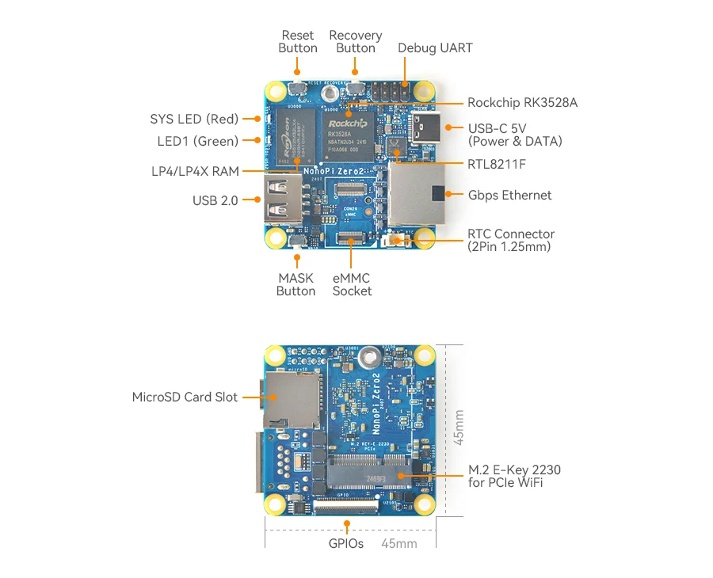
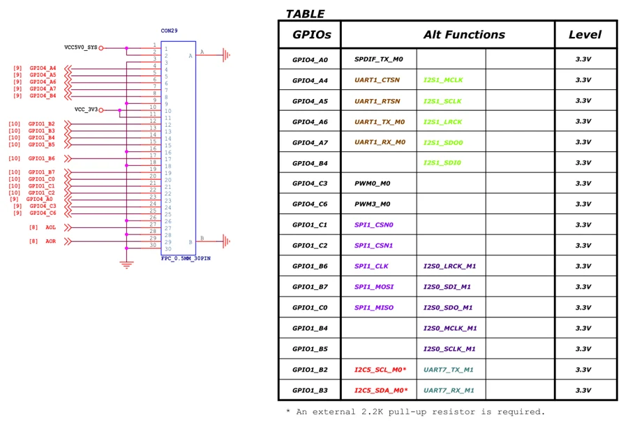

# NanoPi Zero2

**FriendlyELEC** · RK3528A

Revision: Multiple source revisions; match each reference filename

Coverage: Supporting references collected; physical GPIO map still needed

[Browse all manufacturers](../../../../BROWSE.md) · [Devices & IoT](../../../../DEVICES.md) · [Open in the browser guide](https://valleytech-black-wire-guide.pages.dev/?board=friendlyelec-nanopi-zero2)

Architecture: **ARM**

## Datasheets and original documentation

Board datasheet: **not yet recorded**. Visual reference: **available**.

[Original manufacturer hardware website](https://wiki.friendlyelec.com/wiki/index.php/NanoPi_Zero2)

- **hardware-guide / board**: [Manufacturer hardware manual and specifications](https://wiki.friendlyelec.com/wiki/index.php/NanoPi_Zero2) · online
- **schematic / board**: [NanoPi_Zero2_2407_SCH.pdf](https://wiki.friendlyelec.com/wiki/images/3/37/NanoPi_Zero2_2407_SCH.pdf) · online

Match the exact board, carrier and PCB revision. A component datasheet does not define the board header or input-power limits.

[Documentation coverage and remaining gaps](../../../../DOCUMENTATION.md)

## Specifications and hardware documentation

- [Manufacturer specifications & hardware guide](https://wiki.friendlyelec.com/wiki/index.php/NanoPi_Zero2)

## NanoPi_Zero2_Layout.jpg

**board labeling image** · Reviewed source · JPG

[Open original reference](../../../../library/media/70fe5ee7c83b208a69cc54b2ea384293e23c9baec78c04945759b68a431168b9.jpg)

**Credit and rights:** FriendlyELEC / original reference contributors. Asset-specific redistribution and print rights have not been established. Original artwork is not relicensed by the Black Wire editorial license.. Source/manufacturer: FriendlyELEC.

[Source 1](https://wiki.friendlyelec.com/wiki/images/f/f8/NanoPi_Zero2_Layout.jpg) · [Source 2](https://wiki.friendlyelec.com/wiki/index.php/NanoPi_Zero2)

Labeled board and connector locations. This is not a per-pin signal map.

Image revision: NanoPi_Zero2_Layout.jpg

SHA-256: `70fe5ee7c83b208a69cc54b2ea384293e23c9baec78c04945759b68a431168b9`

## NanoPi_Zero2_Gpio.jpg

**pin function reference** · Reviewed source · JPG

[Open original reference](../../../../library/media/b3eba94b6f6d7c8dc60071aae17a336b3f656ed5b08bd2cda1d0ff02a3d05ce4.jpg)

**Credit and rights:** FriendlyELEC / original reference contributors. Asset-specific redistribution and print rights have not been established. Original artwork is not relicensed by the Black Wire editorial license.. Source/manufacturer: FriendlyELEC.

[Source 1](https://wiki.friendlyelec.com/wiki/images/b/b5/NanoPi_Zero2_Gpio.jpg) · [Source 2](https://wiki.friendlyelec.com/wiki/index.php/NanoPi_Zero2)

Schematic connector symbol and function table; this does not establish physical connector orientation.

Image revision: NanoPi_Zero2_Gpio.jpg

SHA-256: `b3eba94b6f6d7c8dc60071aae17a336b3f656ed5b08bd2cda1d0ff02a3d05ce4`

Pin assignments have not been independently electrically verified. Check board revision before wiring.
