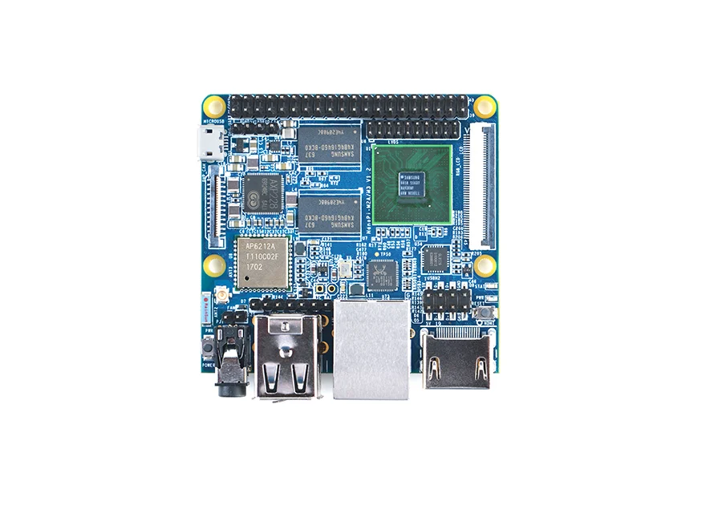

# NanoPi M2A

**FriendlyELEC** · S5P4418

Revision: Multiple source revisions; match each reference filename

Coverage: Supporting references collected; physical GPIO map still needed

[Browse all manufacturers](../../../../BROWSE.md) · [Devices & IoT](../../../../DEVICES.md) · [Open in the browser guide](https://valleytech-black-wire-guide.pages.dev/?board=friendlyelec-nanopi-m2a)

Architecture: **ARM**

## Datasheets and original documentation

Board datasheet: **not yet recorded**. Visual reference: **available**.

[Original manufacturer hardware website](https://wiki.friendlyelec.com/wiki/index.php/NanoPi_M2A)

- **hardware-guide / board**: [Manufacturer hardware manual and specifications](https://wiki.friendlyelec.com/wiki/index.php/NanoPi_M2A) · online
- **schematic / board**: [NanoPi-M2A-M3-1712-Schematic.pdf](https://wiki.friendlyelec.com/wiki/images/a/ac/NanoPi-M2A-M3-1712-Schematic.pdf) · online
- **schematic / board**: [NanoPi-M2A-M3-1604-Schematic.pdf](https://wiki.friendlyelec.com/wiki/images/4/4c/NanoPi-M2A-M3-1604-Schematic.pdf) · online

Match the exact board, carrier and PCB revision. A component datasheet does not define the board header or input-power limits.

[Documentation coverage and remaining gaps](../../../../DOCUMENTATION.md)

## Specifications and hardware documentation

- [Manufacturer specifications & hardware guide](https://wiki.friendlyelec.com/wiki/index.php/NanoPi_M2A)

## NanoPi_M2A-2.jpg

**product photograph** · Reviewed source · JPG

[Open original reference](../../../../library/media/c04fbd63d52ee427ae589fbf4902be59551b900fc5931db255b26f96cadb98f2.jpg)

**Credit and rights:** FriendlyELEC / original reference contributors. Asset-specific redistribution and print rights have not been established. Original artwork is not relicensed by the Black Wire editorial license.. Source/manufacturer: FriendlyELEC.

[Source 1](https://wiki.friendlyelec.com/wiki/images/8/8e/NanoPi_M2A-2.jpg) · [Source 2](https://wiki.friendlyelec.com/wiki/index.php/NanoPi_M2A)

Product photograph only; pin assignments must be read in the manufacturer documentation.

Image revision: NanoPi_M2A-2.jpg

SHA-256: `c04fbd63d52ee427ae589fbf4902be59551b900fc5931db255b26f96cadb98f2`

Pin assignments have not been independently electrically verified. Check board revision before wiring.
