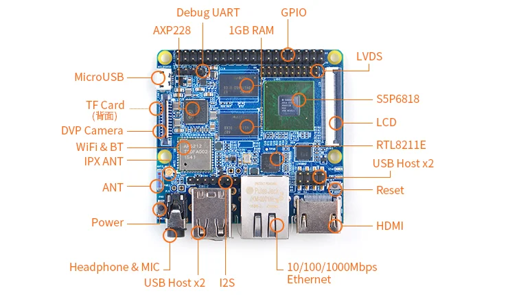

# NanoPi M3

**FriendlyELEC** · S5P6818

Revision: Multiple source revisions; match each reference filename

Coverage: Supporting references collected; physical GPIO map still needed

[Browse all manufacturers](../../../../BROWSE.md) · [Devices & IoT](../../../../DEVICES.md) · [Open in the browser guide](https://valleytech-black-wire-guide.pages.dev/?board=friendlyelec-nanopi-m3)

Architecture: **ARM**

## Datasheets and original documentation

Board datasheet: **not yet recorded**. Visual reference: **available**.

[Original manufacturer hardware website](https://wiki.friendlyelec.com/wiki/index.php/NanoPi_M3)

- **hardware-guide / board**: [Manufacturer hardware manual and specifications](https://wiki.friendlyelec.com/wiki/index.php/NanoPi_M3) · online
- **schematic / board**: [NanoPi-M2A-M3-1712-Schematic.pdf](https://wiki.friendlyelec.com/wiki/images/a/ac/NanoPi-M2A-M3-1712-Schematic.pdf) · online
- **schematic / board**: [NanoPi-M2A-M3-1604-Schematic.pdf](https://wiki.friendlyelec.com/wiki/images/4/4c/NanoPi-M2A-M3-1604-Schematic.pdf) · online

Match the exact board, carrier and PCB revision. A component datasheet does not define the board header or input-power limits.

[Documentation coverage and remaining gaps](../../../../DOCUMENTATION.md)

## Specifications and hardware documentation

- [Manufacturer specifications & hardware guide](https://wiki.friendlyelec.com/wiki/index.php/NanoPi_M3)

## NanoPC-M3-1512B-IF-001.png

**board labeling image** · Reviewed source · PNG

[Open original reference](../../../../library/media/8dd94fab6246bb4cfec2f392c29cf73a15888f59127c8d00355c9c5af56665cb.png)

**Credit and rights:** FriendlyELEC / original reference contributors. Asset-specific redistribution and print rights have not been established. Original artwork is not relicensed by the Black Wire editorial license.. Source/manufacturer: FriendlyELEC.

[Source 1](https://wiki.friendlyelec.com/wiki/images/2/2b/NanoPC-M3-1512B-IF-001.png) · [Source 2](https://wiki.friendlyelec.com/wiki/index.php/NanoPi_M3)

Labeled board and connector locations. This is not a per-pin signal map.

Image revision: NanoPC-M3-1512B-IF-001.png

SHA-256: `8dd94fab6246bb4cfec2f392c29cf73a15888f59127c8d00355c9c5af56665cb`

Pin assignments have not been independently electrically verified. Check board revision before wiring.
