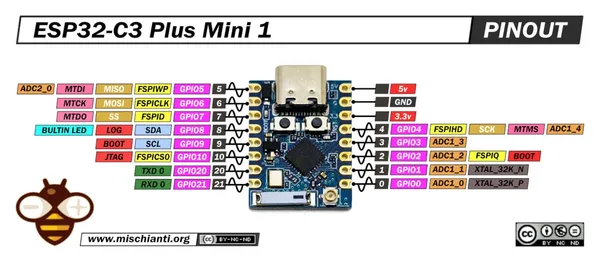

# ESP32-C3 Plus Mini 1 (ESP32-C3_MINI_V1)

**Generic - manufacturer unconfirmed** · ESP32-C3

Revision: MINI_V1  
Coverage: Pinout image collected

[Browse all manufacturers](../../../../BROWSE.md) · [Desktop app](https://github.com/valleytechsolutions/black-wire-desktop)

## Pinout - Renzo Mischianti

**pinout image** · Reviewed source · JPG

[Open original reference](../../../../library/media/e0fbf126ef23cd17cfaee15d9f654d848dc38adfe89f7a15b84de2881eb20895.jpg)

**Credit and rights:** CC BY-NC-ND marking visible on image; exact license version and publication permissions not established. Source/manufacturer: Generic - manufacturer unconfirmed.

[Source 1](https://mischianti.org/wp-content/uploads/2026/02/ESP32-C3-Plus-Mini-1-SuperMini-Series-pinout-low.jpg) · [Source 2](https://mischianti.org/esp32-c3-plus-mini-1-esp32-c3_mini_v1-high-resolution-pinout-datasheet-schema-and-specs/)

Original public image by Renzo Mischianti, unchanged. Diagram/model matching is visual, not electrical verification. Exact PCB layout and revision must match; no inference of compatibility with lookalike marketplace clones. No verified manufacturer attribution; marketplace seller and board designer are not assumed to be the same.

SHA-256: `e0fbf126ef23cd17cfaee15d9f654d848dc38adfe89f7a15b84de2881eb20895`

Pin assignments have not been independently electrically verified. Check board revision before wiring.
