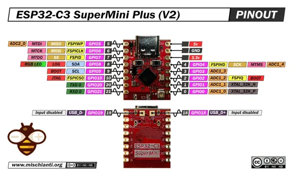

# ESP32-C3 SuperMini Plus (v2)

**Generic - manufacturer unconfirmed** · ESP32-C3

Revision: v2 - red PCB and external antenna connector  
Coverage: Pinout image collected

[Browse all manufacturers](../../../../BROWSE.md) · [Desktop app](https://github.com/valleytechsolutions/black-wire-desktop)

## Pinout - Renzo Mischianti

**pinout image** · Reviewed source · JPG

[Open original reference](../../../../library/media/36e2ddd572a430a02544208f2b4c7f4542de2cfb179adcbe7e5c9a4b68fd0694.jpg)

**Credit and rights:** CC BY-NC-ND marking visible on image; exact license version and publication permissions not established. Source/manufacturer: Generic - manufacturer unconfirmed.

[Source 1](https://mischianti.org/wp-content/uploads/2026/02/ESP32-C3-Super-Mini-Plus-pinout-low.jpg) · [Source 2](https://mischianti.org/esp32-c3-supermini-plus-v2-high-resolution-pinout-datasheet-and-specs/)

Original public image by Renzo Mischianti, unchanged. Diagram/model matching is visual, not electrical verification. Exact PCB layout and revision must match; no inference of compatibility with lookalike marketplace clones. No verified manufacturer attribution; marketplace seller and board designer are not assumed to be the same.

SHA-256: `36e2ddd572a430a02544208f2b4c7f4542de2cfb179adcbe7e5c9a4b68fd0694`

Pin assignments have not been independently electrically verified. Check board revision before wiring.
