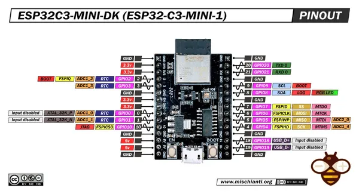

# ESP32C3-MINI-DK

**Generic - manufacturer unconfirmed** · ESP32-C3

Revision: ESP32-C3-MINI-1 module carrier; exact maker unconfirmed  
Coverage: Pinout image collected

[Browse all manufacturers](../../../../BROWSE.md) · [Desktop app](https://github.com/valleytechsolutions/black-wire-desktop)

## Pinout - Renzo Mischianti

**pinout image** · Reviewed source · JPG

[Open original reference](../../../../library/media/004ddda9c358685004537a126ecff7589b40514b144da7af361013b9d39b5be2.jpg)

**Credit and rights:** CC BY-NC-ND marking visible on image; exact license version and publication permissions not established. Source/manufacturer: Generic - manufacturer unconfirmed.

[Source 1](https://mischianti.org/wp-content/uploads/2023/04/esp32c3-mini-dk-esp32-c3-mini-1-pinout-low.jpg) · [Source 2](https://mischianti.org/esp32c3-mini-dk-high-resolution-pinout-and-specs/)

Original public image by Renzo Mischianti, unchanged. Diagram/model matching is visual, not electrical verification. Exact PCB layout and revision must match; no inference of compatibility with lookalike marketplace clones. No verified manufacturer attribution; marketplace seller and board designer are not assumed to be the same.

SHA-256: `004ddda9c358685004537a126ecff7589b40514b144da7af361013b9d39b5be2`

Pin assignments have not been independently electrically verified. Check board revision before wiring.
