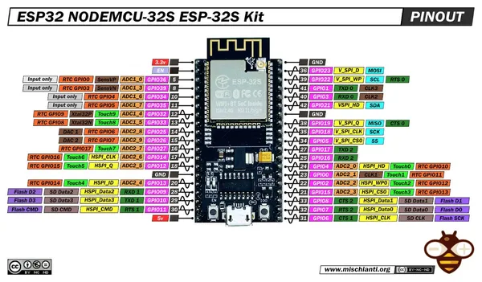

# NodeMCU-32S

**Generic - manufacturer unconfirmed** · ESP32 original

Revision: ESP-32S Kit layout shown  
Coverage: Pinout image collected

[Browse all manufacturers](../../../../BROWSE.md) · [Desktop app](https://github.com/valleytechsolutions/black-wire-desktop)

## Pinout - Renzo Mischianti

**pinout image** · Reviewed source · JPG

[Open original reference](../../../../library/media/0bf465ec6db60ed777a06a1d7fed8b0faeba302b2ae451eab3ddbf6008f30436.jpg)

**Credit and rights:** CC BY-NC-ND marking visible on image; exact license version and publication permissions not established. Source/manufacturer: Generic - manufacturer unconfirmed.

[Source 1](https://mischianti.org/wp-content/uploads/2024/02/ESP32-NODEMCU-ESP-32S-Kit-pinout-low-res-mischianti.jpg) · [Source 2](https://mischianti.org/esp32-nodemcu-32s-esp-32s-kit-high-resolution-pinout-datasheet-and-specs/)

Original public image by Renzo Mischianti, unchanged. Diagram/model matching is visual, not electrical verification. Exact PCB layout and revision must match; no inference of compatibility with lookalike marketplace clones. Diagram title does not establish the maker of all boards sold under this name; attribution remains unconfirmed.

SHA-256: `0bf465ec6db60ed777a06a1d7fed8b0faeba302b2ae451eab3ddbf6008f30436`

Pin assignments have not been independently electrically verified. Check board revision before wiring.
