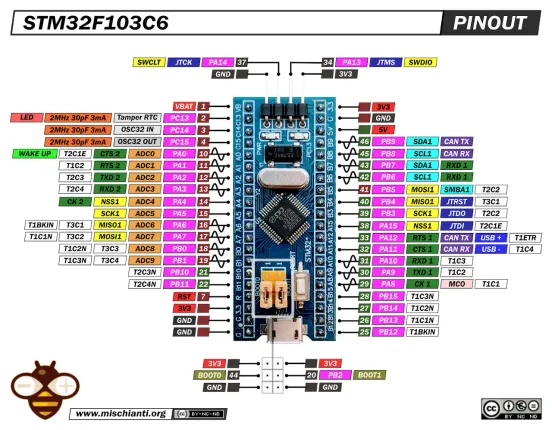

# STM32F103C6T6 Blue Pill

**Generic - manufacturer unconfirmed** · Other

Revision: Not identified  
Coverage: Pinout image collected

[Browse all manufacturers](../../../../BROWSE.md) · [Desktop app](https://github.com/valleytechsolutions/black-wire-desktop)

## Pinout - Renzo Mischianti

**pinout image** · Reviewed source · WEBP

[Open original reference](../../../../library/media/b6ee98538d81e886402ee9ab1c01e34e8ffac9598c2a677593917906b8cca960.webp)

**Credit and rights:** CC BY-NC-ND marking visible on image; exact license version and publication permissions not established. Source/manufacturer: Generic - manufacturer unconfirmed.

[Source 1](https://mischianti.org/wp-content/uploads/2022/02/Pinout-STM32-STM32F1-STM32F103-STM32F103C6-STM32F103C6T6-low-resolution.jpg.webp) · [Source 2](https://mischianti.org/stm32f103c6t6-high-resolution-pinout-and-specs/)

Original public image by Renzo Mischianti, unchanged. Diagram/model matching is visual, not electrical verification. Exact PCB layout and revision must match; no inference of compatibility with lookalike marketplace clones. No verified manufacturer attribution; marketplace seller and board designer are not assumed to be the same.

SHA-256: `b6ee98538d81e886402ee9ab1c01e34e8ffac9598c2a677593917906b8cca960`

Pin assignments have not been independently electrically verified. Check board revision before wiring.
