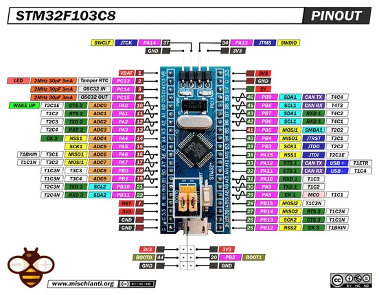

# STM32F103C8T6 Blue Pill

**Generic - manufacturer unconfirmed** · Other

Revision: Not identified  
Coverage: Pinout image collected

[Browse all manufacturers](../../../../BROWSE.md) · [Desktop app](https://github.com/valleytechsolutions/black-wire-desktop)

## Pinout - Renzo Mischianti

**pinout image** · Reviewed source · JPG

[Open original reference](../../../../library/media/f048d899fdf2a2822ed354cfa10feb6769163ab5accbdafed0ae190dd314559f.jpg)

**Credit and rights:** CC BY-NC-ND marking visible on image; exact license version and publication permissions not established. Source/manufacturer: Generic - manufacturer unconfirmed.

[Source 1](https://mischianti.org/wp-content/uploads/2022/02/STM32-STM32F1-STM32F103-STM32F103C8T6-pinout-low-resolution.jpg) · [Source 2](https://mischianti.org/stm32f103c8t6-blue-pill-high-resolution-pinout-and-specs/)

Original public image by Renzo Mischianti, unchanged. Diagram/model matching is visual, not electrical verification. Exact PCB layout and revision must match; no inference of compatibility with lookalike marketplace clones. No verified manufacturer attribution; marketplace seller and board designer are not assumed to be the same.

SHA-256: `f048d899fdf2a2822ed354cfa10feb6769163ab5accbdafed0ae190dd314559f`

Pin assignments have not been independently electrically verified. Check board revision before wiring.
