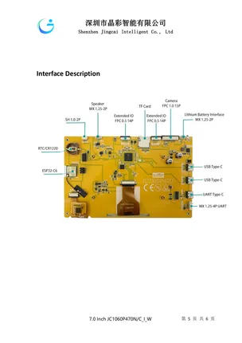

# JC1060P470C_I_W

**Guition** · CYD

Revision: Not identified  
Coverage: Board labels only; pinout needed

[Browse all manufacturers](../../../../BROWSE.md) · [Desktop app](https://github.com/valleytechsolutions/black-wire-desktop)

## Board layout labels - PDF page 5

**board labeling image** · Reviewed source · PNG

[Open original reference](../../../../library/media/a4b492e5e1a1b0c9d6798855ebe6d218b51583bee1844e582e7cde3baa59643f.png)

**Credit and rights:** Not established; source attribution retained. Source/manufacturer: Guition.

[Source 1](https://www.guition.com/icms/upload/fb081940d6fc11f09850077a33e1404f/FTPData/UEditor/file/2026121/1768961093086/JC1060P470C_I_W Specifications-EN.pdf) · [Source 2](https://www.guition.com/-download)

Manufacturer-hosted board reference; select and review physical pinout pages before inclusion. Original PDF page 5 rendered at 220 dpi; no labels changed. This labels board components/connectors and is not a pin-by-pin signal map.

SHA-256: `a4b492e5e1a1b0c9d6798855ebe6d218b51583bee1844e582e7cde3baa59643f`

## Manufacturer reference PDF

**original reference PDF** · Reviewed source · PDF

[Open original reference](../../../../library/media/dcad76418c2086a5b4cb17f8be49f59869b1c5cdf5bc0d5707efc02edc87e859.pdf)

**Credit and rights:** Not established; source attribution retained. Source/manufacturer: Guition.

[Source 1](https://www.guition.com/icms/upload/fb081940d6fc11f09850077a33e1404f/FTPData/UEditor/file/2026121/1768961093086/JC1060P470C_I_W Specifications-EN.pdf) · [Source 2](https://www.guition.com/-download)

Manufacturer-hosted board reference; select and review physical pinout pages before inclusion.

SHA-256: `dcad76418c2086a5b4cb17f8be49f59869b1c5cdf5bc0d5707efc02edc87e859`

Pin assignments have not been independently electrically verified. Check board revision before wiring.
